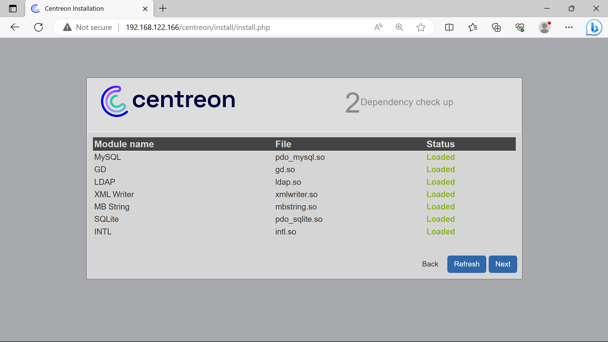
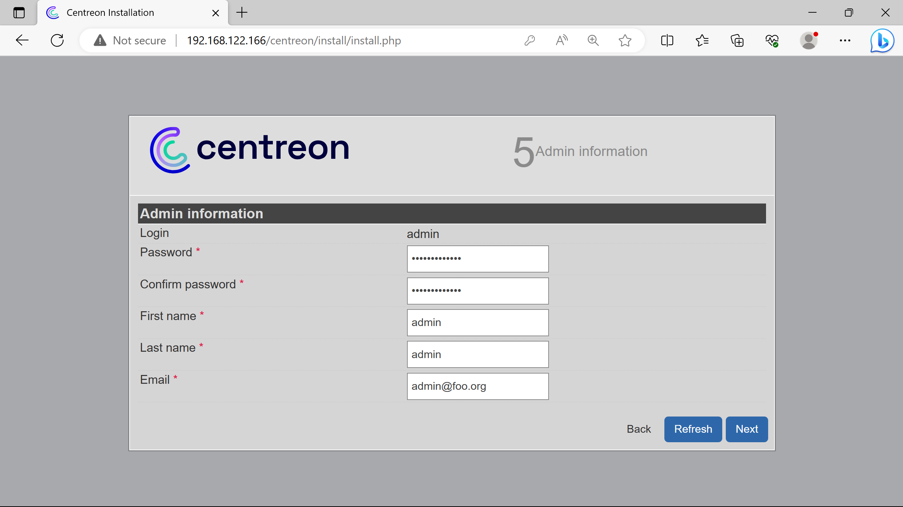
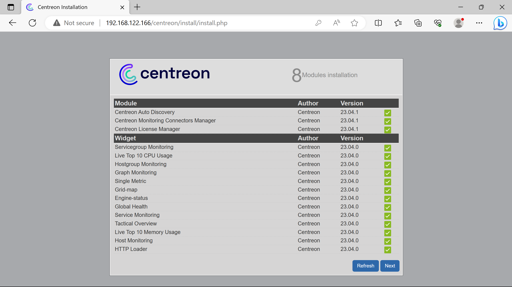
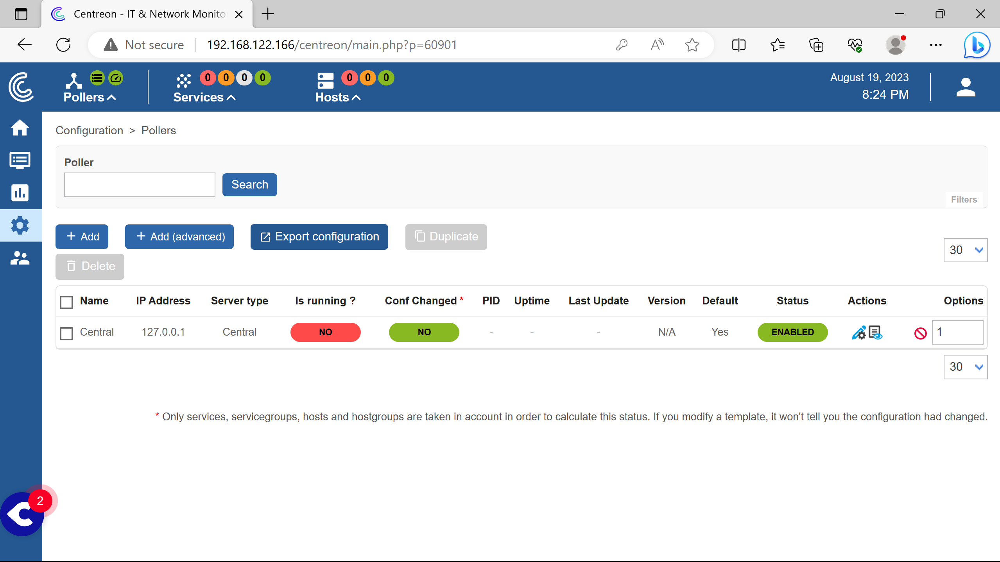

<!-- prologue -->


overviewing centreon it    
& getting fully hands-on


<!-- article -->

## introduction

The last article in this series will be devoted to discover & use Centreon IT.

Feel free to correct me by email if i've said something wrong.

### presentation

[Centreon IT](https://www.centreon.com) is a french open-source based monitoring solution.

It is highly [inspired by Nagios](https://www.centreon.com/centreon-and-nagios-3-milestones-to-understand-their-distinctiveness/), since it was a Nagios frontend at its beginning. 

Centreon's solutions has the same Nagios' plugins & hosts systems but can keep their hands on the plugins with their repository - where [the community can freely publish them for Nagios](https://www.xeylou.fr/posts/nagios-introduction/#fundamentals).

Centreon is a profit-oriented company who has a business model based on licensing the number of hosts monitored.

<!-- 

Quotation is based on the number of equipment devices being monitored. Prices start at 250 monitored devices, then 500, 1000, 2000… sky is the limit. Subscriptions include software licenses, access to our Support team by phone or by mail and unlimited software updates. And Managed Service Providers can benefit from a Pay-per-Use pricing model specifically designed to help them grow their business.

-->

The free solution called Centreon IT-100 is licensed for 100 monitored hosts only - their [Free Trial](https://www.centreon.com/free-trial/). Other differences with the commercial editions are listed in their [comparison table](https://www.centreon.com/centreon-editions/).

## namely

Informations on how Centreon IT works & its specific features.

### organisation

Centreon claims their solutions can be hosted on site, called `OnPrem`, or cloud-based, called `Cloud`.

Centreon instances always works with a Central Server, called `centreon-central` used to configure monitoring, display & operate the collected data.

To monitor multiple sites, instances can be deployed & attached to the Central Server, the `Remote Servers`.

Monitored data is gathered using `Pollers`, attached to the Central or a Remote Server.

Here is what a `Centreon OnPrem` distributed architecture should looks like according to Centreon.


%%{init: {'theme':'dark'}}%%
graph TD
central[Central Server]
remote0[Remote Server]
remote1[Remote Server]
remote2[Remote Server]
poller0((Poller))
poller1((Poller))
poller2((Poller))
poller3((Poller))
poller4((Poller))
poller5((Poller))

central---remote0 & remote1 & remote2
remote0---poller0 & poller1
remote1---poller2 & poller3
remote2---poller4 & poller5


The `Centreon Cloud` architecture does away with Remote Servers, as Pollers are connected to the Central Server via the cloud - using a vpn.


%%{init: {'theme':'dark'}}%%
graph TD
central[Central Server]
poller0((Poller))
poller1((Poller))
poller2((Poller))

central --- poller0 & poller1 & poller2


### hosting 

[Centreon documentation](https://docs.centreon.com/) guides to host onprem & cloud solutions on different supports.

For an overview, they give `*.ovf` & `*.ova` images for virtual box & vmware respectively.

<!-- https://download.centreon.com/#Appliances/ -->
Installations alongside gnu/linux distros is preferable for production use.

<!-- https://docs.centreon.com/docs/installation/installation-of-a-central-server/using-packages/ -->
The documentation guides it for RHEL, Alma/Oracle/Rocky Linux since they are rhel based distros - *(or "were" since [rhel closed their source](https://www.redhat.com/en/blog/furthering-evolution-centos-stream))*.

Less attention is putted on Debian, the documentation is deprecated for it.

<!-- https://docs.centreon.com/docs/21.10/installation/installation-of-a-central-server/using-centreon-iso/ -->
<!-- https://download.centreon.com/#version-21-10/ -->
In the past - until ver. 21.10, they used to create `*.iso` images to install their solutions alongside centos.

### connectors & plugins

<!-- https://docs.centreon.com/cloud/monitoring/pluginpacks/ -->
Data collection performed by Centreon models called `Monitoring Connectors` which have `Plugins` assets.

Plugins have the same function as Nagios ones.

Installed & used by pollers, they are sets of commands to monitor various kinds of metrics, on differents type of hosts regarding many protocols.

Plugins & connectors are maintained in their [centreon-plugins](https://github.com/centreon/centreon-plugins) & [centreon-connectors](https://github.com/centreon/centreon-connectors) repositories, where it seems community can contribute.

<!-- https://docs.centreon.com/docs/21.10/monitoring/pluginpacks/ -->
<!-- https://docs.centreon.com/docs/administration/licenses/ -->
Although it's opensource, a license is required to access the full Plugin Pack on their solutions.

## deploying

Installing Centreon IT-100, doing a simple windows & linux hosts monitoring.

### requirements

The infrastructure size depends on the number of hosts to monitor.

Centreon recommends using lvm to manage their file systems - working fine without, but should be planned for production use.

A stand-alone central server is used under 500 hosts. Pollers every 500 hosts are expected with a database server if more than 2'500 hosts.

For production use, it would be a good idea to think about scalability.

Since there would be too much information to display (partitionning, specs, infrastructure), i let you refer to their [infrastructure sizes charts](https://docs.centreon.com/docs/installation/prerequisites/#characteristics-of-the-servers).

### infrastructure

An infrastructure similar to that used in the [nagios article](https://www.xeylou.fr/posts/nagios-introduction/#infrastructure) will be deployed.

Following the [requirements](#requirements) - *partially since it is not for production use*, a stand-alone Central server will be deployed with its poller. 

Here is what the used infrastructure looks like.


%%{init: {'theme':'dark'}}%%
graph TD

subgraph lan[LAN]
router{Router}
switch[Switch]
centreon(Centreon Central Server<br><font color="#a9a9a9">192.168.122.166</font>)
linux(Debian Host<br><font color="#a9a9a9">192.168.122.164</font>)
win(Windows Host<br><font color="#a9a9a9">192.168.122.251</font>)
mariadb[(MariaDB server)]
poller((Poller))
end

wan{WAN}---router
router---switch
switch---centreon
switch---linux
switch---win
centreon-.-mariadb & poller



### installation

Centreon IT will be installed without license on Debian 11.

I made an installation script available on [Github](https://github.com/xeylou/centreon-it-overview/blob/main/debian-centreon-install.sh).

This script installs Centreon IT from added Centreon's apt repositories & install a secured mysql server through mariadb.

To execute it, run the following commands.

```bash
mkdir testing && cd testing
wget https://raw.githubusercontent.com/xeylou/centreon-it-overview/main/debian-centreon-install.sh
chmod +x debian-centreon-install.sh
./debian-centreon-install.sh
```

Installation can be resumed going on the Centreon web interface `http://192.168.122.166`.

*(cannot highlight forms natively, so i specify the changes, otherwise i just do next, install or finish)*




More dependencies than the ones loaded could be presented as `Not loaded` for debugging (if not using the script).




Creation of an admin account for the Centreon interface.


Connexion to the db server. The root password was asked & created by the script at the end.

Used `localhost` (so 127.0.0.1 or ::1) for the db server ip address, since its hosted on the same host as the future centreon central server.

Creation of a db user to perform data querries - for security purposes, not doign them with an admin one.





Login created step `5 Admin information`.


This is the after-loggin page.

After the installation, the Central server poller is not working.

Additionnal steps are required to start monitoring.


Go to the poller section to see it.




Need to click on `Export configuration`.


Select the `Central` poller.


Check `Move Export File`.


Then `Export`.

After that, run the following commands, keep their order without modifying them.


```bash
systemctl restart cbd centengine
systemctl restart gorgoned
systemctl start snmptrapd centreontrapd
systemctl start snmpd
```

Then the poller starts working.


*(the red circle at top left, to the right of Pollers logo disappears later, see screenshots below)*

### snmp plugins

Centreon recommends using their snmp implementation plugins to gather metrics - *cpu load, memory usage etc.*

Usage of the snmp protocol garantees the monitoring to work as intended since the protocol is universal - rather than installing an agent.

Plugins can be added using the web interface or by using the system package manager (dnf for rhel based distros & apt for the debian family).

Here is the installation of the needed snmp plugins using the web interface.


Adding the linux snmp plugin clicking `+`.


`Base Pack` is an expected dependency that will be installed choosing `Apply`.


Doing the same for windows snmp plugin, no more dependency needed.


Result.

On wanted monitored hosts, snmp must be configured and working.

<!--

apt install -y snmp
nano /etc/snmp/snmp.conf

-->

### linux host


**Note** I've explained what were done with snmp rather than just *throwing you my script* as you may need this explainations to monitor other devices like switches or routers. *(which doesn't mean i haven't [made one](http://github.com/xeylou/centreon-it-overview))*


For our needs, according to the [debian snmp page](https://wiki.debian.org/SNMP), a repo needs to be added to `/etc/apt/source.list`.

```bash {linenos=inline, hl_lines=["22-23"]}
# deb cdrom:[Debian GNU/Linux 11.7.0 _Bullseye_ - Official amd64 NETINST 20230429-11:49]/ bullseye main

#deb cdrom:[Debian GNU/Linux 11.7.0 _Bullseye_ - Official amd64 NETINST 20230429-11:49]/ bullseye main

deb http://deb.debian.org/debian/ bullseye main
deb-src http://deb.debian.org/debian/ bullseye main

deb http://security.debian.org/debian-security bullseye-security main
deb-src http://security.debian.org/debian-security bullseye-security main

# bullseye-updates, to get updates before a point release is made;
# see https://www.debian.org/doc/manuals/debian-reference/ch02.en.html#_updates_and_backports
deb http://deb.debian.org/debian/ bullseye-updates main
deb-src http://deb.debian.org/debian/ bullseye-updates main

# This system was installed using small removable media
# (e.g. netinst, live or single CD). The matching "deb cdrom"
# entries were disabled at the end of the installation process.
# For information about how to configure apt package sources,
# see the sources.list(5) manual.

# snmp needs
deb http://httpredir.debian.org/debian bullseye contrib non-free
```

<!-- 
https://www.enzo-lefort.fr/pdf/SISR5/TP%20_Centreon_SNMP_LEFORT.pdf
https://pixelabs.fr/configuration-snmp-windows-linux-esxi/
https://blog.foulquier.info/tutoriels/supervision/mise-en-place-d-une-supervision-systeme-sur-debian-7-avec-snmpd-et-centreon-3-0
-->

After that, the needed packages can be installed.

```bash
apt update
apt install -y snmp snmptrapd snmp-mibs-downloader
```

Checking if the snmp service is running properly.

```bash
systemctl status snmpd
```

If not, it needs to be started.

```bash
systemctl start snmpd
```

Before making changes to the snmp daemon configuration file `/etc/snmp/snmpd.conf`, a backup is always welcome.

```bash
cp /etc/snmp/snmpd.conf{,.old}
```

The snmp protocol will listen for connections on all interfaces on port 161 udp for ipv4 & ipv6. 

SNMP will wait for a specific ip address under a certain `community` called public here.

Modifications are done in `/etc/snmp/snmpd.conf`.

```bash {linenos=inline, hl_lines=["9"], linenostart=41}
# agentaddress: The IP address and port number that the agent will listen on.
#   By default the agent listens to any and all traffic from any
#   interface on the default SNMP port (161).  This allows you to
#   specify which address, interface, transport type and port(s) that you
#   want the agent to listen on.  Multiple definitions of this token
#   are concatenated together (using ':'s).
#   arguments: [transport:]port[@interface/address],...

agentaddress  udp:0.0.0.0:161,udp6:[::]:161
```

```bash {linenos=inline, hl_lines=["7"], linenostart=67}
# rocommunity: a SNMPv1/SNMPv2c read-only access community name
#   arguments:  community [default|hostname|network/bits] [oid | -V view]

# Read-only access to everyone to the systemonly view
# rocommunity  public default -V systemonly
# rocommunity6 public default -V systemonly
rocommunity public 192.168.122.166
```

After that, the snmp service needs to be restarted.

```bash
systemctl restart snmpd
```

This command can be run from the Centreon Central Server to check if the configuration is working.

```bash
snmpwalk -v2c 192.168.122.164 -c public
```

If it does, a lot of text will be displayed rather than this output: *Timeout: No Response from 192.168.122.164*.

*(if you are working with snmp layer: this command retrieves records from mib by going through each oid running automatic getnext requests, so you don't need a command for each oid or node, on snmp ver. 2c asked with "public" community)*

### windows host

The windows host is a windows server.

The snmp protocol will be enabled on it, authorizing only the centron-central to communicate via a community named `public`.

On the Server Manager window.

*(here i can nicely highlight the forms)*


Select the hostname of the windows server.


No need to add anything, just go `Next`.


Search for the `SNMP Service` & enable `SNMP WMI Provider`.


Right after that go `Next`.


The snmp service needs to be configured in the Server Manager window.


Find the `SNMP Service` among the services.


Add a `community`, here public, the same as the one configured on the debian host.

`Read Only` is preferable because nothing has to be changed, just the metrics to be gathered.

The Centreon server needs to be trusted by entering its ip address.


Let's click `Ok` (does `Apply` & quit).


Then `Restart` the service to make the changes take effect.

The same command used to check the connectivity of the debian host can be used for the windows one, changing the ip address.

```bash
snmpwalk -v2c 192.168.122.251 -c public
```

### adding hosts

Before adding the hosts to Centreon, it would be pleasant to check their snmp connectivity.

```bash
snmpwalk -v2c 192.168.122.251 -c public
snmpwalk -v2c 192.168.122.164 -c public
```

If the Centreon server can reach them, they can be added to its interface.


Go to the `Hosts` configuration.


Click on `Add`.


Filling with the informations for [debian host](#linux-host) & some arbitraty ones.


`Save`.

*(the Default equals Yes for the two cases)*


Doing the same for the [windows host](#windows-host) informations.


The host are added, should looks like so.

The pollers need to actualize their configuration files to starts monitoring the hosts.


*(note the red Yes on Conf Changed)*


Export the configuration in a file for pollers ***but this time also restart them***.


To see the hosts & their services status.


After 5 minutes or a `Force check`.


Incomming ping (echo requests) are blocked by the windows firewall by default in windows client & server.

Although it is marked as critical, it doesn't shows up like so in the services section at the top left...

### adding services

More services can be monitored by adding them into the centreon interface.


Click on `Add`.


Services to monitor can be added according to what plugins are installed in the Centreon server.

The sheet with an eye is a small documentation on the command arguments, parameters, etc. 


The Default options are Yes in the three cases.

An then export the configuration & restart the pollers to make changes take effect, like did at the end of [adding hosts](#adding-hosts).  
*(to avoid putting a third time the captures how to do it)*

### debugging

Passives checks commands can be seen, helping a lot for debugging.

It can also helps for active monitoring without dealing with the Centreon interface.

Here is how to do so with the swap services.


The syntax is the same for the windows & the linux smp plugins except the `--plugin` option.

The services commands syntax are the same, the `--mode` option change for `cpu`, `load`, `memory`, `uptime`, etc.

## close

Here are some commands that helped me (hope can help you) for debugging - apart from connectivity debugging, because i had to debug a lot compared to itop or nagios

```bash
systemctl status cbd
systemctl status gorgoned
systemctl status centreon
systemctl status centengine
systemctl status snmptrapd
```

*(btw the centreon service has never been active...)*

There are many more services to know & check to understand a problem at the beginning.

In Nagios, for the same kind of interface (checking hosts services) you just have the nagios service to check for errors.

For centreon, the gathering, the processing, the display parts & more are seperate ones.

It's better seperating parts of codes for debugging or reliability, but having a single service that reports all problems can be pleasant (or just not so many services).

I got hard times to find were a problem could come from sometimes, since the numbers of potential services problem was huge.

I also understand that centreon as more features (graphs etc.) than nagios base, not xi.

Centreon uses nagios plugins, in the same directory as nagios does by default...

Nagios has a [page dedicated to CVEs](https://www.nagios.com/products/security/) to prove their concern & patches. There may be one, but i haven't found a "security concern" or issues page" for Centreon.

That's disappointing since monitoring systems needs to be very aware of their security.

Centreon systems were also targetted by russian attackers ([article 1](https://thehackernews.com/2021/02/hackers-exploit-it-monitoring-tool.html), [article 2](https://www.wired.com/story/sandworm-centreon-russia-hack/)).

It is a very good idea to display the command used to check a service, i think i hadn't seen that in nagios.