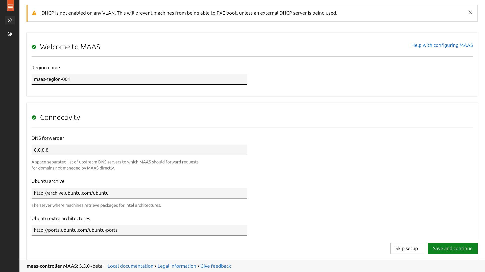
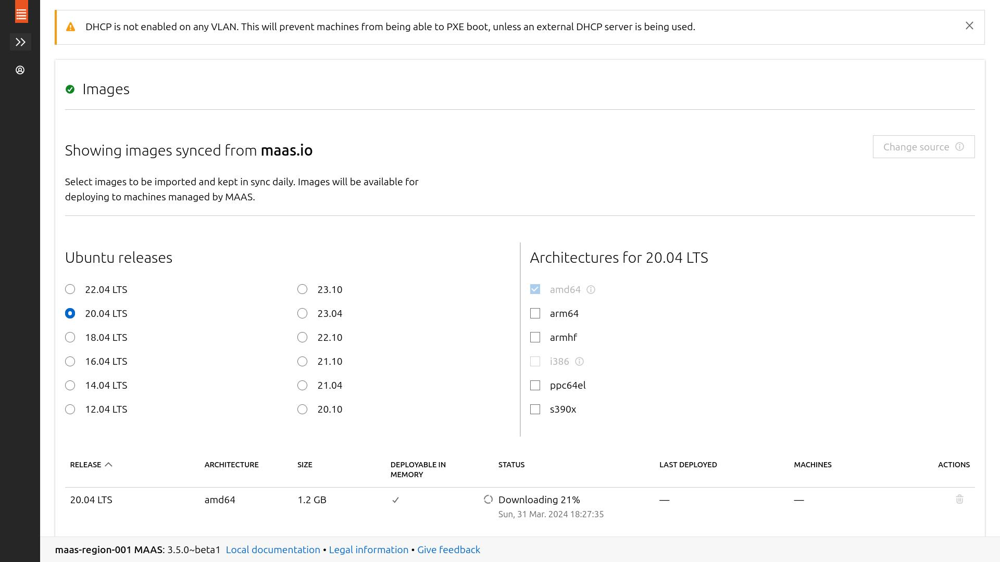

<!-- ```bash
rm ~/.ssh/known_hosts
ssh-keygen -t ed25519 -N "" -f "$HOME/.ssh/maas-global"
ssh-copy-id -i .ssh/maas-global.pub root@192.168.122.2
echo -e "host maas-controller\n  hostname 192.168.122.2\n  user xeylou\n  preferredauthentications publickey\n  identityfile ~/.ssh/maas-hosts" >> ~/.ssh/config
ssh maas-controller
``` -->

```bash
nano /etc/ssh/sshd_config && systemctl restart sshd # PermitRootLogin prohibit-password

systemctl disable --now systemd-timesyncd
echo 1 > /proc/sys/net/ipv4/ip_forward
sysctl -p /etc/sysctl.conf

snap install --channel=latest/edge maas
apt install -y postgresql
#sed -i '/maas-controller/d' /etc/hosts
#echo -e "\n# maas nodes\nmass-controller 127.0.0.1\nmaas-node-001 172.16.0.2\nmaas-node-002 172.16.0.3" >> /etc/hosts
export MAAS_DBADDRESS="127.0.0.1"
export MAAS_DBUSER=maas-db-user
export MAAS_DBPASS=maas-db-password
export MAAS_DBNAME=maas-psql-db
export MAAS_USER=xeylou
export MAAS_USEREMAIL=xeylou@proton.me
sudo -i -u postgres psql -c "CREATE USER \"$MAAS_DBUSER\" WITH ENCRYPTED PASSWORD '$MAAS_DBPASS'"
sudo -i -u postgres createdb -O "$MAAS_DBUSER" "$MAAS_DBNAME"
echo "host    $MAAS_DBNAME    $MAAS_DBUSER    0/0     md5" >> /etc/postgresql/14/main/pg_hba.conf
maas init region+rack --database-uri "postgres://$MAAS_DBUSER:$MAAS_DBPASS@$MAAS_DBADDRESS/$MAAS_DBNAME"
maas createadmin --username=$MAAS_USER --email=$MAAS_USEREMAIL
```

à partir de là, web ui ou commandes par api rest

```bash
export MASS_URL=http://192.168.122.2:5240/MAAS
export SSH_PUB_KEY="ssh-ed25519 AAAAC3NzaC1lZDI1NTE5AAAAIBqsO6NmAqx3m4W/ocuLn//lNLEb5KUh9bdB1li84jGT xeylou@null"
maas apikey --username=$MAAS_USER > $MAAS_USER-api-key-file
export MAAS_API_KEY=$(cat $MAAS_USER-api-key-file)
maas login $MAAS_USER $MASS_URL $MAAS_API_KEY
maas $MAAS_USER maas set-config name=upstream_dns value="8.8.8.8"
maas $MAAS_USER sshkeys create "key=$SSH_PUB_KEY"
```

après ça on peut tout skip

maintenant configuration dhcp

```bash
ssh -J maas-controller maas-node-001
ping 172.16.0.1
dig maas-controller.maas
```

<!--
ssh-keygen -t ed25519 -N "" -f "$HOME/.ssh/maas-hosts"
nano ~/.ssh/config

# maas-controller
host maas-controller
  hostname 192.168.122.2
  user xeylou
  preferredauthentications publickey
  identityfile ~/.ssh/maas-hosts

ssh-copy-id -i .ssh/maas-hosts.pub root@192.168.122.2

apt update && apt install -y nano
nano /etc/netplan/00-installer-config.yaml
netplan apply

-->

```bash
apt update && apt install -y nano
systemctl disable --now systemd-timesyncd
echo 1 > /proc/sys/net/ipv4/ip_forward
sed -i '/maas-controller/d' /etc/hosts
echo -e "\n#maas\nmass-controller 127.0.0.1\nmaas-node-001 172.16.0.11\nmaas-node-002 172.16.0.12" >> /etc/hosts
# although i hate snap
#snap info maas
# name:      maas
# summary:   Metal as a Service
# publisher: Canonical✓
# store-url: https://snapcraft.io/maas#   3.4/stable:       3.4.1-14343-g.a552d2522       2024-03-18 (34087) 140MB -
#   3.4/candidate:    ↑                                                      
#   3.4/beta:         ↑
# contact:   https://discourse.maas.io/
# license:   AGPL-3.0
# description: |
#   Total automation of your physical servers for amazing data center
#   operational efficiency.
# snap-id: shY22YTZ3RhJJDOj0MfmShTNZTEb1Jiq
# channels:
#   3.4/stable:       3.4.1-14343-g.a552d2522       2024-03-18 (34087) 140MB -
#   3.4/candidate:    ↑                                                      
#   3.4/beta:         ↑                                                      
#   3.4/edge:         3.4.1-14345-g.ad897f83f       2024-03-25 (34359) 140MB -
#   latest/stable:    –                                                      
#   latest/candidate: –                                                      
#   latest/beta:      –                                                      
#   latest/edge:      3.5.0~beta1-16547-g.bcbb6120f 2024-03-30 (34542) 196MB -
#   3.5/stable:       –                                                      
#   3.5/candidate:    3.5.0~beta1-16214-g.1eeea8524 2024-03-05 (33939) 195MB -
#   3.5/beta:         3.5.0~beta1-16214-g.1eeea8524 2024-03-05 (33899) 195MB -
#   3.5/edge:         3.5.0~rc1-16248-g.faf85e165   2024-03-27 (34446) 196MB -
#   3.3/stable:       3.3.6-13230-g.3e02a33c3       2024-03-13 (33860) 138MB -
#   3.3/candidate:    ↑                                                      
#   3.3/beta:         ↑                                                      
#   3.3/edge:         3.3.6-13234-g.41fb68392       2024-03-25 (34366) 138MB -
#   3.2/stable:       3.2.10-12065-g.0093bc7ec      2024-01-29 (32954) 148MB -
#   3.2/candidate:    3.2.10-12065-g.0093bc7ec      2024-03-30 (34535) 148MB -
#   3.2/beta:         3.2.10-12065-g.0093bc7ec      2024-01-29 (32954) 148MB -
#   3.2/edge:         3.2.10-12065-g.0093bc7ec      2024-01-19 (32954) 148MB -
#   3.1/stable:       3.1.3-10930-g.2eb4e7525       2024-02-26 (33606) 142MB -
#   3.1/candidate:    3.1.1-10918-g.9cbd96fd2       2024-03-30 (34534) 142MB -
#   3.1/beta:         ↑                                                      
#   3.1/edge:         3.1.3-10930-g.2eb4e7525       2024-02-16 (33606) 142MB -
#   3.0/stable:       3.0.2-10056-g.089ec66c2       2024-02-26 (33607) 143MB -
#   3.0/candidate:    3.0.0-10029-g.986ea3e45       2022-11-15 (24909) 143MB -
#   3.0/beta:         ↑                                                      
#   3.0/edge:         3.0.2-10056-g.089ec66c2       2024-02-16 (33607) 143MB -
#   2.9/stable:       2.9.3-9276-g.76e9dd1e6        2023-08-29 (30206) 141MB -
#   2.9/candidate:    ↑                                                      
#   2.9/beta:         2.9.3-9276-g.76e9dd1e6        2023-08-29 (30206) 141MB -
#   2.9/edge:         2.9.3-9276-g.76e9dd1e6        2023-08-23 (30206) 141MB -
#   2.8/stable:       2.8.7-8610-g.4a04daa43        2021-09-16 (16381) 135MB -
#   2.8/candidate:    2.8.7-8610-g.4a04daa43        2021-09-16 (16381) 135MB -
#   2.8/beta:         ↑                                                      
#   2.8/edge:         2.8.9~rc1-8615-g.235c64cb7    2022-10-26 (24701) 136MB -
#   2.7/stable:       2.7.3-8290-g.ebe2b9884        2020-08-21  (8724) 144MB -
#   2.7/candidate:    ↑                                                      
#   2.7/beta:         ↑                                                      
#   2.7/edge:         2.7.3-8297-g.68a767295        2021-02-16 (11806) 143MB -

snap install --channel=latest/edge maas

# bdd de test, non prod ready snap install maas-test-db
apt install -y postgresql

export MAAS_DBUSER=maas-db-user
export MAAS_DBPASS=maas-test-password
export MAAS_DBNAME=maas-db
export HOSTNAME=maas-controller

sudo -i -u postgres psql -c "CREATE USER \"$MAAS_DBUSER\" WITH ENCRYPTED PASSWORD '$MAAS_DBPASS'"
sudo -i -u postgres createdb -O "$MAAS_DBUSER" "$MAAS_DBNAME"
echo "host    $MAAS_DBNAME    $MAAS_DBUSER    0/0     md5" >> /etc/postgresql/14/main/pg_hba.conf

maas init region+rack --database-uri "postgres://$MAAS_DBUSER:$MAAS_DBPASS@$HOSTNAME/$MAAS_DBNAME"

# root@maas-controller:~# maas init region+rack --database-uri "postgres://$MAAS_DBUSER:$MAAS_DBPASS@$HOSTNAME/$MAAS_DBNAME"
# MAAS URL [default=http://192.168.122.2:5240/MAAS]:
# VALIDE AVEC ENTREE
# MAAS has been set up.             

# If you want to configure external authentication or use
# MAAS with Canonical RBAC, please run

#   sudo maas configauth

# To create admins when not using external authentication, run

#   sudo maas createadmin

# To enable TLS for secured communication, please run

#   sudo maas config-tls enable

export maas_normal_user=xeylou
export maas_user_email=xeylou@proton.me
maas createadmin --username=$maas_normal_user --email=$maas_user_email

# Password: 
# Again:
# Import SSH keys [] (lp:user-id or gh:user-id):

# http://192.168.122.2:5240/MAAS/r/
```

toute la configuration suivante peut se faire en ligne de commande sinon

```bash
export maas_url=http://192.168.122.2:5240/MAAS
export ssh_pub_key=YOUR_SSH_PUBLIC_KEY
maas apikey --username=$maas_normal_user > api-key-file
maas login $maas_normal_user $maas_url < (cat api-key-file)
maas $maas_normal_user maas set-config name=upstream_dns value="8.8.8.8"
maas $maas_normal_user sshkeys create "key=$ssh_pub_key"
# voir les images synced
maas $maas_normal_user boot-resources read | jq -r '.[] | "\(.name)\t\(.architecture)"'

maas $PROFILE boot-source-selections create 1 os="ubuntu" release="trusty" arches="amd64" subarches="*"  labels="*"


```



region name
dns fowarder

/!\ download tout seul et vous ne pourrez pas la supprimer

fabric sont interfaces réseau (voir explications glossaire)

pour la 13, allez sur untagged

14 configure dhcp, mais je peux fusionner avec images d'avant

15 obligation de reserver range avant

maintenant, plus qu'à créer nos vm et les faire boot en réseau

16 les problèmes

sudo -i -u postgres psql -c "\l"
sudo -i -u postgres psql
<!-- \l -->
<!-- \c maas-db; -->

je réionstalle le tout en changeant l'ordre des interfaces réseaux dans virt-manager pour metre en premier celle sur le réseau isolé

### configuration subnet


https://maas.io/docs/reference-installation-requirements
https://launchpad.net/maas
https://launchpad.net/maas/+series
https://maas.cloud.cbh.kth.se/MAAS/docs/cli/how-to-change-maas-settings.html

maas status
snap restart maas


to do so, i'll make a dynamic nat using iptables && ip foward  
*(i added the address 192.168.122.3 to the enp2s0 interface)*

```bash
apt install -y iptables-persistent
echo 'net.ipv4.ip_forward=1' >> /etc/sysctl.conf && sysctl -p /etc/sysctl.conf
iptables -t nat -A POSTROUTING -o enp2s0 -j MASQUERADE
```

i can also do static nat to get access to my node from the outside

```bash
iptables -t nat -A PREROUTING -i enp2s0 -j DNAT -d 192.168.122.3 --to 172.16.0.2
iptables -t nat -A POSTROUTING -o enp1s0 -j SNAT -s 172.16.0.2 --to 192.168.122.3 
```