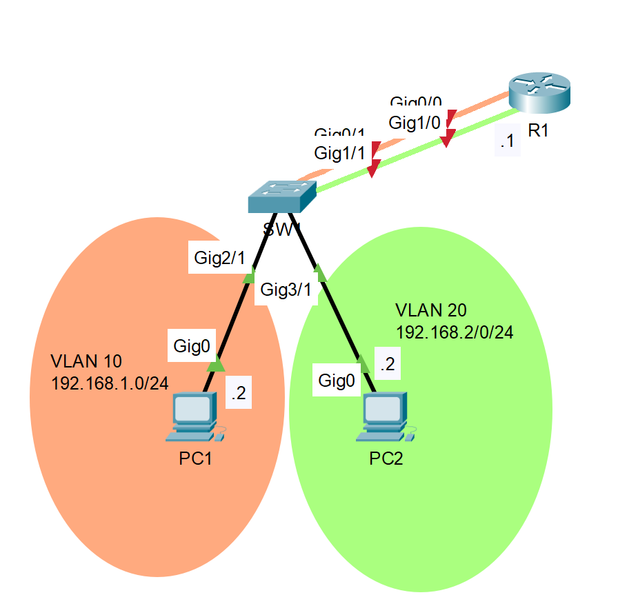
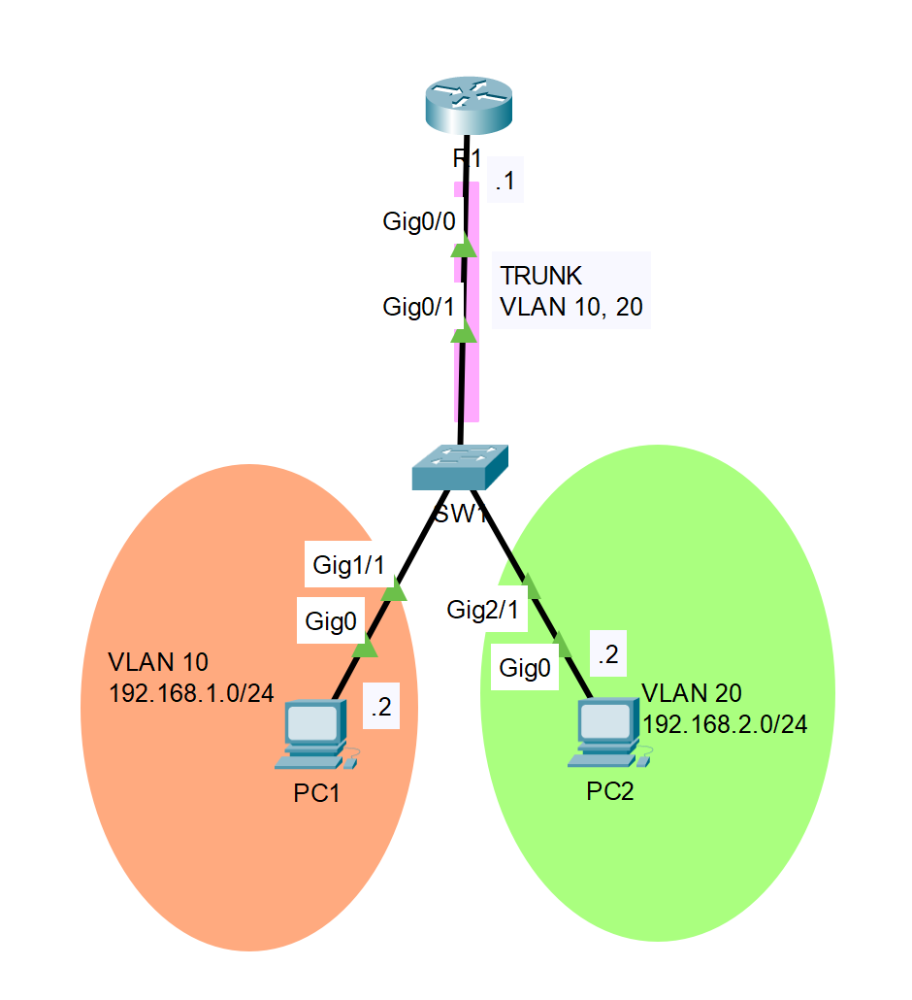

<!-- prologue -->


prise en main du routage  
inter-vlan sur équipements cisco


<!-- article -->

## introduction

je crée finalement une série d'articles dédiés à r301, le module abordant du cisco cli évalué en pratique

cet article est dédié à la compréhension & à l'étude des principes liés au routage inter-vlan, pas à de l'exploration technique ou une utilisation avancée

j'expose uniquement les bases du routage inter-vlan, libre à vous de chercher plus loin

*si vous avez compris cet article, les tp devraient être sympa à faire*

## rappels vlan

<!-- les vlan *virtual lan* servent à faire de la ségmentation réseau sur la couche 2 du modèle osi -->

les vlan servent à faire de la ségmentation réseau

les machines d'un vlan ne pourront communiquer qu'avec les autres machines du même vlan (ségmentation)

<!-- ainsi, les vlans seuls permettent de séparer les différents réseaux présents sur un équipement -->

l'application des vlans se fait généralement sur un switch

les ports d'un switch sont associés à un (ou plusieurs) vlans, les machines derrières ces ports sont par conséquent affectées à ces vlans sans qu'elles ne le sachent

de ce fait, les machines du vlan `X` auront accès uniquement aux autres machines du vlan `X`, si tous les liens entre les deux autorisent le passage de ce vlan

*side note: tous les ports d'un switchs ont un vlan par défaut & natif : le vlan 1, donc tout le monde se voit partout*

*en français on appelerait ça le "taggage de paquets IP", chaque trâme étant taguée par un vlan par le protocole 801.1q, ou isl*

## principes d'inter-vlan

les vlans ségmentarisent les réseaux sur la couche 2 du modèle OSI

il n'est pas possible de les contourner en remontant les couches, ni en les descendant (aller sur le support...)

cependant, il est parfois nécessaire de faire communiquer des machines appartenant à des vlans différents

<!-- *e.g. dans un réseau d'entreprise avec un vlan `COMPTA` & un vlan `SECRETAIRES`, les deux auraient besoin de faire communiquer des informations* -->

une machine devrait donc se charger de faire passer les trâmes d'un vlan pour un autre vlan

le remède à tout ça serait un `routeur`, qui transfère les trames d'un vlan à un autre, comme d'un réseau à un autre

cela existe sur beaucoup de routeurs (pas que cisco)

leur spécificité étant qu'ils font du routage entre les vlan : du `routage inter-vlan`

## notions annexes

cette notion sera abordée pour la suite

un lien peut transporter plusieurs vlans, mais ces vlans ne se verront pas

il faut que les ports aux extrémités du lien soient configurés de la même manière (sur deux switchs par exemple)

pour faire passer plusieurs vlans sur un seul lien, il sera monté en mode `trunk`

## méthodes d'inter-vlans

un routeur peut faire du routage inter-vlan de la même manière qu'il le fait pour des réseaux physiques

un exemple ici


%%{init: {'theme':'dark'}}%%
graph TD
r1{R1}
sw1[SW1]
sw2[SW2]
pc1[PC1]
pc2[PC2]

r1 ---|vlan 10| sw1
r1 ---|vlan 20| sw2
sw1 ---|vlan 10| pc1
sw2 ---|vlan 20| pc2


cependant, selon les réseaux, un bien plus grand nombre de vlan peut être amené à être routé (30, 50+ ...)

l'idée de garder un lien par vlan, comme on le ferait pour un réseau, devient alors insensée

l'utilisation des ports en mode trunk est alors conseillé pour transporter plusieurs vlan sur un seul lien

le routeur comprenant l'arrivée des trâmes taguées

le routage devenant alors `on stick`


%%{init: {'theme':'dark'}}%%
graph TD
r1{R1}
sw1[SW1]
pc1[PC1]
pc2[PC2]

r1 ---|trunk<br>vlan 10, 20<br>| sw1
sw1 ---|vlan 10| pc1
sw1 ---|vlan 20| pc2


<!-- exemples simples d'application des différentes [méthodes d'inter-vlan](#méthodes-inter-vlans) -->

<!-- https://www.ccnablog.com/inter-vlan-routing/#:~:text=Configuring%20inter-VLAN%20routing%20using%20router-on-a-stick%201%20Step%201.,4%20Step%204.%20...%205%20Step%205.%20 -->

## routage simple

comme dit [méthodes d'inter-vlan](#méthodes-dinter-vlans), le routage peut se faire en utilisant des liens physiques

cette méthode n'est pas utilisée car serait beaucoup trop couteuse & inutile (pour 48 vlan, acheter un routeur physique de 48 ports ça ne se fait pas...)

je l'expose tout de même ici car demandé en tp

les notions de routage restent les mêmes, les vlans ayant des adresses réseaux différentes -> c'est comme des réseaux physiques

si l'on se base sur la topologie suivante




télécharger le fichier packet tracer vierge


voici les commandes de configuration des équipements

j'omets d'expliquer les commandes: elles devraient être transparentes -> ce sont les mêmes que pour du routage simple

configuration du switch SW1

```bash
enable
configure terminal
hotsname SW1
no ip domain-lookup
int g0/1
switchport access vlan 10
int g1/1
switchport access vlan 20
int g2/1
switchport access vlan 10
int g3/1
switchport access vlan 20
end
```

> les ports d'un switch sont UP par défaut, pas besoin de la commande `no shutdown`  
> 
> pas besoin de la commande `switchport mode access`, les ports le sont par défaut  
> 
> pas besoin de déclarer les vlan, `vlan 10` par exemple, s'ils ne sont pas déjà crées le switch le fera à la volée  

configuration du routeur R1

```bash
enable
configure terminal
hotsname R1
no ip domain-lookup
int g0/0
ip address 192.168.1.1 255.255.255.0
no shut
int g1/0
ip address 192.168.2.1 255.255.255.0
no shut
end
```

après l'attribution d'une adresse ip à PC1 & PC2 & renseignement de leur passerelle -> ils pourront communiquer

*attendez bien quelques secondes que le ping se terminent...*

## routage on stick

le routage inter-vlan on stick possède les mêmes propritétés que le [routage inter-vlan simple](#routage-simple)

l'unique exception étant l'utilisation d'un lien `trunk` pour le passage des vlans du switch au routeur

cela implique au routeur de connaitre les vlans transmis sur ce lien -> pour se configurer une adresse ip sur chaque vlan & leur servir de passerelle

pour cela, le routeur va découper son interface en `sous-interfaces` pour chaque vlan demandé

ces sous-interfaces seront les passerelles des machines pour leur réseau local (définies par le vlan sur lequel elles sont)

je considèrerai l'infrastructure suivante




télécharger le fichier packet tracer vierge


configuration R1

```bash
enable
configure terminal
hostname R1
no ip domain-lookup
int g0/0
no shutdown
int g0/0.10
encapsulation dot1Q 10
ip address 192.168.1.1 255.255.255.0
no shut
int g0/0.20
encapsulation dot1Q 20
ip address 192.168.2.1 255.255.255.0
no shut
end
```

> `int g0/0.10` créer la sous-interface 10 sur le port GigabitEthernet0/0
>
> `encapsulation dot1Q 10` utilisera le vlan 10 sur cette interface


**Note** Pour que les sous-interfaces fonctionnent, il faut que l'interface sur laquelle elles sont déclarées soit en `no shutdown` *(pour ne pas que vous panniquiez aucontrôle...)*


configuration SW1

```bash
enable
configure terminal
hostname SW1
no ip domain-lookup
int g0/1
switchport mode trunk
int g1/1
switchport access vlan 10
int g2/1
switchport access vlan 20
end
```

> pas besoin de créer un vlan avec la commande `vlan 10` par exemple, si inexistant -> il va le créer  
>
> pas besoin `switchport trunk allowed vlan 10,20` car ne fait pas de restriction par défaut, accepte tous les vlans  
>
> pas besoin `switchport trunk native vlan 1` non plus

commandes utiles pour débogger

```bash
show running-config
show ip route
show ip interface brief
```