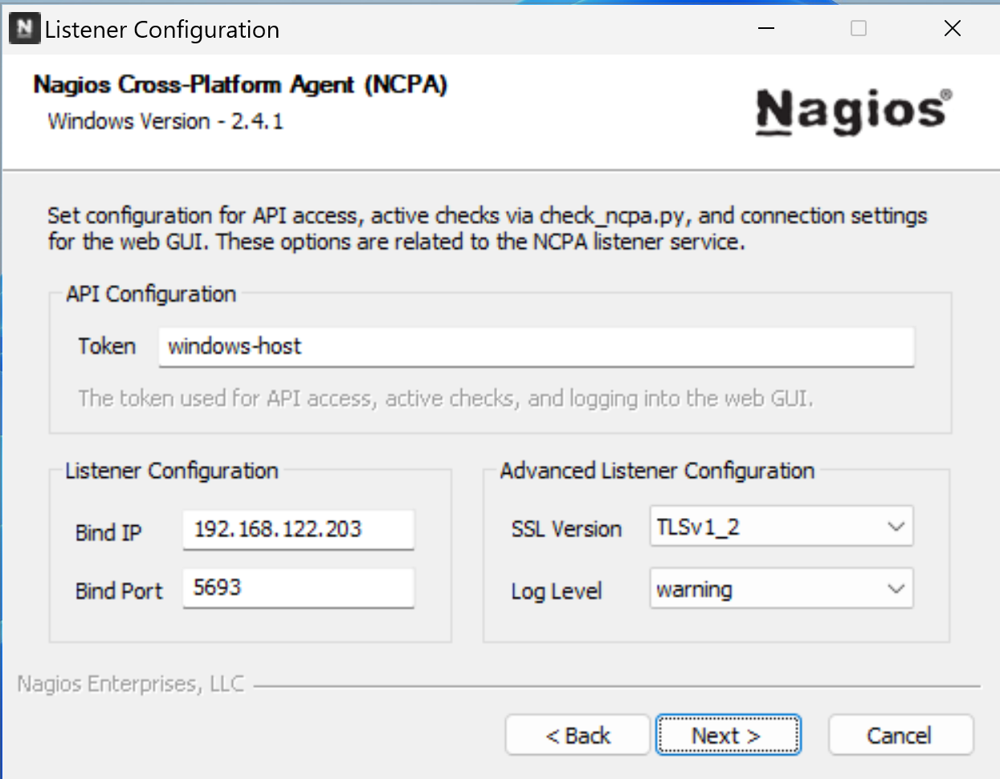
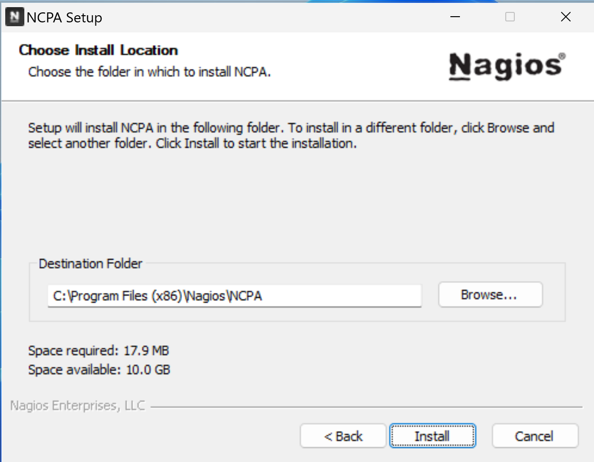
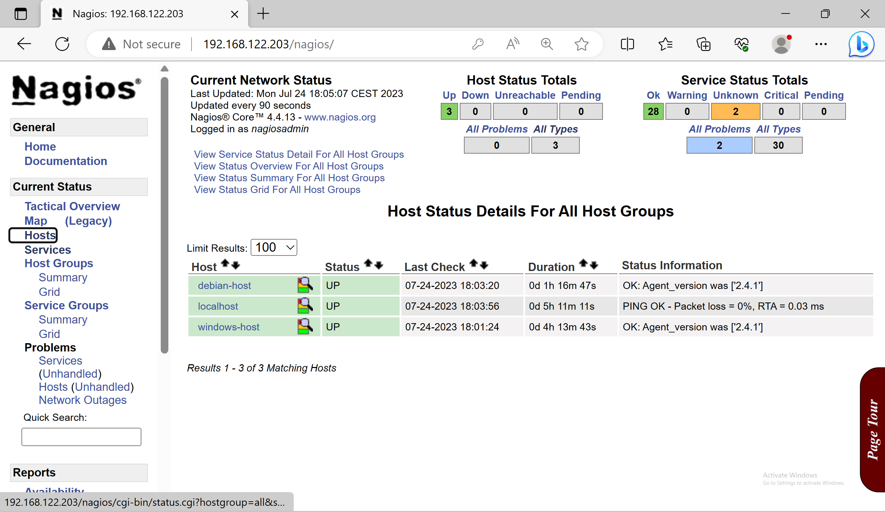

<!-- prologue -->


understanding Nagios principles & deploying  
a monitoring infrastructure using custom scripts


<!-- article -->

## introduction

For my work-study, i immersed myself in understanding Nagios.

Here i expose what i've learned & what i've done with it.

I'd be extremely grateful if you'd consider correcting me if i said something wrong.

This article mainly talks about Nagios as the Nagios Core solution.

### presentation

[Nagios Core](https://www.nagios.org/projects/nagios-core/) is an open source, widely used monitoring tool for hosts, applications & services.

The company behind Nagios, [Nagios Enterprises](https://www.nagios.com/about-nagios-enterprises/), makes profit by selling solutions around Nagios Core.

They provide non-free solutions to make the Nagios Core utilisation simplified, such as a more sophisticated dashboard - [Nagios XI](https://www.nagios.com/products/nagios-xi/), or a better network implementation - [Nagios Network Analyzer](https://www.nagios.com/products/nagios-network-analyzer/).

Those solutions are improvers for Nagios Core, highly prefered for production use but not mandatory.

### side notes

Nagios Core source code can be found on [Github](https://github.com/NagiosEnterprises/nagioscore), it is written in C language.

You may also consider, regarding your deontology or your use case, using your own metrics collector to serve them into a dashboard - using Prometheus & Grafana for example.

## nagios principles

Covering the basics of Nagios Core according to monitoring a windows host & a linux host with their services.

### fundamentals

Nagios Core needs to be installed on a host, bare metal or in a vm - no official docker image available.

To monitor hosts, the Nagios server will execute a sequence of commands at a sheduled interval & will define the state of the monitored host/service according to the output of the sequence.

This series of checks can be customised according to what service to monitor.

A simple & in use example can be the default `HOST STATUS` check by Nagios: the Nagios server send an echo request to the host: if it receive an echo reply back -> `HOST STATUS: UP`, else -> `HOST STATUS: DOWN`.

Apart from well-known protocols, to monitor the largest amount of services, Nagios lets its community post their own `Projects`.

Since then, the community created & shared their free [plugins](#plugins) & [add-ons](#add-ons) to monitor their needed little-known services - all in their [Nagios Exchange](https://exchange.nagios.org/) platform.

### plugins

The commands used to monitor services are called `plugins`.

Plugins are located in `/usr/local/nagios/libexec/` with their name starting with `check_*`.

These plugins can be used as executable files to quickly check the status of a service.

Those actions are parts of "active monitoring", which is very usefull during pre-production tests.

Example of an active check with `check_http` plugin.

```bash
/usr/local/nagios/libexec/check_http -h
```
> display the check_http  
plugin help page   

Following the `check_http` help page, this check can be executed on a host to check its http response.

<!-- /usr/local/nagios/libexec/check_tcp -H 192.168.122.15 -p 80 -->

```bash
/usr/local/nagios/libexec/check_http -H 192.168.122.15
```
> HTTP OK: HTTP/1.1 200 OK - 10975 bytes in 0.002 second response time |time=0.001620s;;;0.000000 size=10975B;;;0

### add-ons

Plugins only monitor external metrics.

To monitor internal ones like system utilization (cpu load, ram, disk usage etc.), Nagios use what they call `add-ons`.

Add-ons are splited software, an `agent` on the monitored host waiting for a gathering query & an executable file on the nagios server to communicate with the agent api.

Those add-ons often use tokens or passwords to verify the authenticity of the nagios server.

From the Nagios server side, the add-ons will be used as executable files like plugins are.

### nagios configuration files

Nagios `*.cfg` configuration files are located in `/usr/local/nagios/etc/`.

```
.
├── cgi.cfg
├── htpasswd.users
├── nagios.cfg
├── ressource.cfg
└── objects
   ├── commands.cfg
   ├── contacts.cfg
   ├── localhost.cfg
   ├── printer.cfg
   ├── switch.cfg
   ├── templates.cfg
   ├── timeperiodes.cfg
   └── windows.cfg
```

Since they are well documented inside & on the web, i'll just outline their purpose.

The `nagios.cfg` is the main Nagios configuration file.

It contains informations such as log files location, individual or grouped [hosts configuration files](#hosts-configuration-files) locations, services check interval & more.

A standard `htpasswd.users` is created in the installation process & define the Nagios users & passwords.

CGIs check their `cgi.cfg` configuration file to gather user & groups permissions<!--  & rights -->. It also contains the path for Nagios frontend files.

`ressource.cfg` define macros used in hosts configuration files for sensitive informations. Also provides plugins paths - handy for moving plugins or adding custom ones.

*("sensitive informations" e.g.: to monitor non public metrics on a database, a username & a password is needed at some point)*

Configuration files inside the `objects` directory are used to define commands, contacts, hosts, services etc. (more on that in [hosts configuration files](#hosts-configuration-files))

### hosts configuration files

Nagios monitor hosts by scheduling [plugins](#plugins) tasks or calling [add-ons](#add-ons) & reporting the results on a control panel.

To define what checks should be made on which host, Nagios use `Object Configuration Files`. 

These are `*.cfg` configuration files in which you define the host informations & the `check_` commands that should be used.

It is recommended to create directories according to your kind of hosts - create a folder for all windows hosts, linux servers etc.

Otherwise, configuration files can be manually added to the `nagios.cfg` like the `localhost.cfg` is by default.

## deployment
Demonstration of [how nagios works](#how-nagios-works).

Deploying an infrastructure based on the system monitoring of a server or client `Windows Host` & a `Debian Host`.

### network plan
```goat
                               +-------------------------+
                               |                         |
                               |     Network Switch      |
                               |                         |
                               +----------+-+-+----------+
             +----------------------------+ + +---------------------------+
             |                              |                             |
             | .---------------.            | .--------------.            | .---------------.
             || 192.168.122.203 |           || 192.168.122.53 |           || 192.168.122.165 |
             | '---------------'            | '--------------'            | '---------------'
+------------+------------+   +-------------+-----------+    +------------+------------+
|                         |   |                         |    |                         |
|      Nagios Server      |   |       Windows Host      |    |       Debian Host       |
|                         |   |                         |    |                         |
+-------------------------+   +-------------------------+    +-------------------------+
```

### windows host

[Add-ons](#add-ons) are needed to monitor hosts system activity.

A lot of agents are available for windows & linux hosts. [Nagios Cross-Platform Agent (NCPA)](https://www.nagios.org/ncpa/) will be used because it is still recently maintained (by Nagios Enterprises).

*(note: for community maintained one, [NSclient++](https://nsclient.org/) for windows & linux seems to be a good choice)*

To install NCPA, start by downloading & executing the agent installer on the host.


Download the latest NCPA agent installer


Here are the simple following steps for the install.

*(highlighted forms are clicked/changed values)*




`Bind IP` default value is `0.0.0.0` to accept every ip address who request metrics - replaced by the Nagios Server ip address.

`Port` & `Token` can be changed.





### debian host

NCPA will also be used for the debian host so that the check commands syntax will be the same for both hosts.

I made an installation script for the debian agent, source code is on [Github](https://github.com/xeylou/nagios-introduction) for debian 11 & 12.

```bash
mkdir testing && cd testing
wget https://raw.githubusercontent.com/xeylou/nagios-introduction/main/debian-ncpa-install.sh
chmod +x debian-ncpa-install.sh
./debian-ncpa-install.sh
```

By using it, it will ask you the Nagios Server ip address & a custom token so that only it can gather metrics.

Changes are made by changing the `allowed_hosts` & the `community_string` variables in `/usr/local/ncpa/etc/ncpa.cfg`.

For other linux distributions than debian, the [ncpa download page](https://www.nagios.org/ncpa/#downloads) can be usefull.

The default `5693` port is used to transfer metrics.

### nagios server

The Nagios Server is in my case a Debian machine that host Nagios Core & the Nagios Plugins.

I made an [installation script for those](https://github.com/xeylou/nagios-introduction) by compiling code from source - tested on debian 11 & 12.

```bash
mkdir testing && cd testing
wget https://raw.githubusercontent.com/xeylou/nagios-introduction/main/debian-nagios-install.sh
chmod +x debian-nagios-install.sh
./debian-nagios-install.sh
```

Nagios web interface can be reach at `http://192.168.122.203/nagios` with the username `nagiosadmin` & the password given at the beginning of the installation.

Can check the connectivity to the agent on the windows host using the `check_ncpa` add-on command.

```
/usr/local/nagios/libexec/check_ncpa.py -H 192.168.122.53 -t 'windows-host' -P 5693 -M system/agent_version
```
> OK: Agent_version was ['2.4.1']

For the debian one (changing values).

```
/usr/local/nagios/libexec/check_ncpa.py -H 192.168.122.165 -t 'debian-host' -P 5693 -M system/agent_version
```
> OK: Agent_version was ['2.4.1']

*(note: the `-H` parameter is the host's hostname or its ip address, `-t` is for the token created by the host during the agent installation process, `-P` the used port & `-M` the called value)*

Example of active monitoring of the cpu load for both (same syntax).

Refer to the [ncpa documentation](https://www.nagios.org/ncpa/help.php) to gather other metrics.

```bash
/usr/local/nagios/libexec/check_ncpa.py -H 192.168.122.53 -t 'windows-host' -P 5693 -M cpu/percent -w 20 -c 40 -q 'aggregate=avg'
```
> OK: Percent was 4.70 % | 'percent'=4.70%;20;40;

Here on the debian host.

```bash
/usr/local/nagios/libexec/check_ncpa.py -H 192.168.122.165 -t 'debian-host' -P 5693 -M cpu/percent -w 20 -c 40 -q 'aggregate=avg'
```
> OK: Percent was 0.00 % | 'percent'=0.00%;20;40;

To add the hosts to the nagios web interface for passive monitoring: the Nagios Server requires their `.cfg` configuration files.

Starting by creating two directories to organise them: `windows-hosts` & `debian-hosts` (see [hosts configuration files recommendation](#hosts-configuration-files)).

```bash
mkdir /usr/local/nagios/etc/windows-hosts
mkdir /usr/local/nagios/etc/debian-hosts
```
Added them to the `/usr/local/nagios/etc/nagios.cfg` nagios configuration file.

```bash {linenos=table, hl_lines=["5-6"], linenostart=47}
# You can also tell Nagios to process all config files (with a .cfg
# extension) in a particular directory by using the cfg_dir
# directive as shown below:

cfg_dir=/usr/local/nagios/etc/windows-hosts
cfg_dir=/usr/local/nagios/etc/debian-hosts
#cfg_dir=/usr/local/nagios/etc/servers
#cfg_dir=/usr/local/nagios/etc/printers
#cfg_dir=/usr/local/nagios/etc/switches
#cfg_dir=/usr/local/nagios/etc/routers
```

These files define the hosts inside `define host` and its `services` to monitor.

Here is an example of the `define host` used for monitoring the debian host in `/usr/local/nagios/debian-hosts/debian-host.cfg`.

```bash {linenos=inline, hl_lines=["2-4"]}
define host {
    host_name               debian-host
    address                 192.168.122.165
    check_command           check_ncpa!-t 'debian-host' -P 5693 -M system/agent_version
    max_check_attempts      5
    check_interval          5
    retry_interval          1
    check_period            24x7
    contacts                nagiosadmin
    notification_interval   60
    notification_period     24x7
    notifications_enabled   1
    register                1
}
```

`host_name` is used for nagios to identify the host on its interface. The `check_command` defines the checked parameter for the `HOST STATUS`.

Here is an example to implement the cpu load check to the configuration file by defining a `service` to monitor.

```bash {linenos=inline, hl_lines=[2, 4], linenostart=16}
define service {
    host_name               debian-host
    service_description     CPU Load
    check_command           check_ncpa!-t 'debian-host' -P 5693 -M cpu/percent -w 20 -c 40 -q 'aggregate=avg'
    max_check_attempts      5
    check_interval          5
    retry_interval          1
    check_period            24x7
    notification_interval   60
    notification_period     24x7
    contacts                nagiosadmin
    register                1
}
```

A command can be used to check errors in your `*.cfg` configuration files before restarting nagios service.

Here is an example with the debian host `*.cfg` file.

```bash
/usr/local/nagios/bin/nagios -v /usr/local/nagios/etc/debian-hosts/debian-host.cfg
```

Finishing by restarting Nagios service to make changes take effect.

```sh
systemctl restart nagios
```

### overview

Once logged into the nagios web interface, the hosts status can be see in the `Hosts` section of the `Current Status`.



The services status are available in the `Services` one.


## close

I found the [nagios documentation](https://www.nagios.org/documentation/) quite well explained (using & compiling from source) although sometimes obsolete *- relating to discontinued stuff* or frustrating *- some requirements missing from current repos*.

Nagios Core is very very old, when doing my searching i was often finding myself reading forums posts from 2007-2009.

Another thought on Nagios Core is that its "unalive" today. Near nothing need to be changed in the code, because it does what it said on the tin.

The only things its team wants to work on now might be their [cost solutions](https://www.nagios.com/downloads/nagios-xi/change-log/). However it's for mission criticial tasks or companies wanted stuff that people charge off.

*The real power is in the nagiosXI* from a reddit user, and i found it sad from.

Otherwise, i like nagios core flexibility by its check commands & its community that is still alive & contribute to plugins & add-ons.