<!-- prologue -->


installation d'un serveur mail mx postfix  
avec dovecot & utilisation avec thunderbird


<!-- article -->

## introduction

je continue l'avancée des workshops avec un serveur mail postfix avec dovecot, pour l'envoi & la réception de mails

il pourra être utilisé avec utilisateurs gnu/linux ou virtuels

topologie utilisée


%%{init: {'theme':'dark'}}%%
graph TD
subgraph 192.168.122.0/24
postfix[r303-deb12-postfix<br><font color="#a9a9a9">192.168.122.10</font>]
bind9[r303-deb12-bind9<br><font color="#a9a9a9">192.168.122.11</font>]
thunderbird[r303-deb12-client<br><font color="#a9a9a9">192.168.122.12</font>]
pstf(Service Postfix)
dovecot(Service Dovecot)
bind(Service Bind9)
clients(Mozilla Thunderbird)
gw{NAT<br><font color="#a9a9a9">192.168.122.1</font>}
end

wan{WAN}
wan --- gw
gw --- postfix & bind9
gw --- thunderbird
postfix -.- pstf & dovecot
bind9 -.- bind
thunderbird -.- clients


## vm postfix

modification nom d'hôte
```bash
hostnamectl set-hostname r303-deb12-postfix && logout
```
attribution adresse ip statique
```bash
nano /etc/network/interfaces
```
```bash {linenos=table, hl_lines=["9-11"], linenostart=4}
source /etc/network/interfaces.d/*

# The loopback network interface
auto lo
iface lo inet loopback

# The primary network interface
allow-hotplug enp1s0
iface enp1s0 inet static
address 192.168.122.10/24
gateway 192.168.122.1
```
```bash
systemctl restart networking
```

<!-- <mark>very important words</mark>

H<sub>2</sub>O

X<sup>2</sup> -->

installation paquet postfix & mailutils pour envoi/réception de mails entre utilisateurs

```bash
apt install -y postfix mailutils
```

> `Internet Site` -> `rzo.lan`

*pour que postfix propose de prendre un nom de domaine, qui sera finalement utilisé pour les mails*

si installation sans accroc : service postfix actif

```bash
systemctl status postfix
```

fichier de configuration global postfix `/etc/postfix/main.cf`

commente tout ce qui touche au tls car pas utilisé ici

ajout d'informations pour l'utilisation du service

```bash
nano /etc/postfix/main.cf
```
```bash {linenos=table, hl_lines=["2-4", "6-8", "11-13", "17-21"], linenostart=26}
# TLS parameters
# smtpd_tls_cert_file=/etc/ssl/certs/ssl-cert-snakeoil.pem
# smtpd_tls_key_file=/etc/ssl/private/ssl-cert-snakeoil.key
# smtpd_tls_security_level=may

# smtp_tls_CApath=/etc/ssl/certs
# smtp_tls_security_level=may
# smtp_tls_session_cache_database = btree:${data_directory}/smtp_scache


mydomain = rzo.lan
# smtpd_relay_restrictions = permit_mynetworks permit_sasl_authenticated defer_unauth_destination
myhostname = r303-deb12-postfix.rzo.lan
alias_maps = hash:/etc/aliases
alias_database = hash:/etc/aliases
myorigin = /etc/mailname
mydestination = $mydomain, $myhostname, localhost.$mydomain, localhost
# relayhost = 
mynetworks = 127.0.0.0/8 192.168.122.0/24 
home_mailbox = Maildir/
mailbox_size_limit = 51200000
recipient_delimiter = +
inet_interfaces = all
inet_protocols = ipv4
```
<!-- https://www.postfix.org/postconf.5.html -->
> `alias_maps` table des noms & des adresses de `mydestination`  
> `alias_database` table des noms d'usages de `alias_maps`  
> `myorigin` pas de nom de domaine -> ajoute celui dans fichier  
> `mydestination` domaines acceptés d'échange  
> `recipient_delimiter` truc@$mydomain & truc+random@$mydomain == les mêmes (pourriel)

<!-- *mydestination changé le deuxième, est-ce qu'il avait eu un bug car précisé au lieu de réutiliser variable* -->

vérification syntaxique après édition

```bash
postfix check
```

redémarrage du service pour appliquer les modifications

```bash
systemctl restart postfix
```

création de deux users gnu/linux


**Note**  mot de passe contingeant à l'authentification...


```bash
adduser --gecos "" user1 && adduser --gecos "" user2
```

connexion à l'un des deux users pour test d'envoi

```bash
su user1
```

```bash
mail user2
```
> Cc:  
> Subject: test envoi user2  
> contenu du mail  

envoi avec retour à la ligne puis <mark>CTRL + D</mark>

connexion sur l'utilisateur récepteur

```bash
su user2
```

vérification de la réception du mail

```bash
ls ~/Maildir/new/ | wc -l
```

`1` si nouveau mail car fichier dans `~/Maildir/new/`

dossier `~/Maildir` défini dans `/etc/postfix/main.cf`

### dovecot

serveur imap & pop3

installation du daemon imap de dovecot

```bash
apt install -y dovecot-imapd
```

*autres paquets dans la suite `dovecot-*`, e.g. `dovecot-ldap` pour support ldap*

fichiers de configuration de dovecot dans `/etc/dovecot/conf.d/`

<!-- https://doc.dovecot.org/configuration_manual/authentication/ -->

modification des méthodes d'authentification

```bash
nano /etc/dovecot/conf.d/10-auth.conf
```

précision de tout laisser passer en clair

```bash {linenos=table, hl_lines=[6], linenostart=5}
# Disable LOGIN command and all other plaintext authentications unless
# SSL/TLS is used (LOGINDISABLED capability). Note that if the remote IP
# matches the local IP (ie. you're connecting from the same computer), the
# connection is considered secure and plaintext authentication is allowed.
# See also ssl=required setting.
disable_plaintext_auth = no
```

définition des méchanismes d'authentification (`login` obsolète mais toujours utilisé)

```bash {linenos=table, hl_lines=[5], linenostart=96}
# Space separated list of wanted authentication mechanisms:
#   plain login digest-md5 cram-md5 ntlm rpa apop anonymous gssapi otp
#   gss-spnego
# NOTE: See also disable_plaintext_auth setting.
auth_mechanisms = plain login
```

modification de l'emplacement de destination des mails

```bash
nano /etc/dovecot/conf.d/10-mail.conf
```

```bash {linenos=table, hl_lines=[9], linenostart=22}
# See doc/wiki/Variables.txt for full list. Some examples:
#
#   mail_location = maildir:~/Maildir
#   mail_location = mbox:~/mail:INBOX=/var/mail/%u
#   mail_location = mbox:/var/mail/%d/%1n/%n:INDEX=/var/indexes/%d/%1n/%n
#
# <doc/wiki/MailLocation.txt>
#
mail_location = maildir:~/Maildir
```

modification de la gestion des logs *- a été utile*

```bash
nano /etc/dovecot/conf.d/10-logging.conf
```

```bash {linenos=table, hl_lines=[3, 13], linenostart=5}
# Log file to use for error messages. "syslog" logs to syslog,
# /dev/stderr logs to stderr.
log_path = /var/log/dovecot.log

# Log file to use for informational messages. Defaults to log_path.
#info_log_path = 
# Log file to use for debug messages. Defaults to info_log_path.
#debug_log_path = 

# Syslog facility to use if you're logging to syslog. Usually if you don't
# want to use "mail", you'll use local0..local7. Also other standard
# facilities are supported.
syslog_facility = mail
```
```bash {linenos=table, hl_lines=[2], linenostart=39}
# Log unsuccessful authentication attempts and the reasons why they failed.
auth_verbose = yes
```

```bash {linenos=table, hl_lines=[2], linenostart=50}
# Even more verbose logging for debugging purposes. Shows for example SQL
# queries.
auth_debug = yes
```
application des modifications

```bash
systemctl restart dovecot
```

vérification du fonctionnement

```bash
telnet -l user1 localhost 143
```
> a login user2 user2  

*où user2 l'utilisateur et user2 son mot de passe*

### utilisateurs virtuels

création user `vmail` avec `/opt/messagerie` comme home directory

création groupe `vmail` avec group id de 5000

```bash
groupadd -g 5000 vmail
```

création du user

```bash
useradd -g vmail -u 5000 vmail -d /opt/messagerie -m
```
> `-g` son groupe  
> `-u 5000` user id de 5000  
> `-d /opt/messagerie` son répertoire utilisateur/home `~`  
> `-m` créer son `~` si inexistant  

indication à postfix de `vmail` & du repertoire `/opt/messagerie` pour la gestion des boites aux lettres

```bash
nano /etc/postfix/main.cf
```
```bash {linenos=table, hl_lines=["18-25"], linenostart=26}
# TLS parameters
# smtpd_tls_cert_file=/etc/ssl/certs/ssl-cert-snakeoil.pem
# smtpd_tls_key_file=/etc/ssl/private/ssl-cert-snakeoil.key
# smtpd_tls_security_level=may

# smtp_tls_CApath=/etc/ssl/certs
# smtp_tls_security_level=may
# smtp_tls_session_cache_database = btree:${data_directory}/smtp_scache


mydomain = rzo.lan
# smtpd_relay_restrictions = permit_mynetworks permit_sasl_authenticated defer_unauth_destination
myhostname = r303-deb12-postfix.rzo.lan
alias_maps = hash:/etc/aliases
alias_database = hash:/etc/aliases
myorigin = /etc/mailname
mydestination = $mydomain, $myhostname, localhost.$mydomain, localhost
default_transport = dovecot
mail_spool_directory = /opt/messagerie/
virtual_mailbox_base = /opt/messagerie/
virtual_mailbox_domains = hash:/etc/postfix/vdomain
virtual_mailbox_maps = hash:/etc/postfix/vmail
virtual_alias_maps = hash:/etc/postfix/valias
virtual_uid_maps = static:5000
virtual_gid_maps = static:5000
# relayhost = 
mynetworks = 127.0.0.0/8 192.168.122.0/24 
home_mailbox = Maildir/
mailbox_size_limit = 51200000
recipient_delimiter = +
inet_interfaces = all
inet_protocols = ipv4
```
> `default_transport` protocole/serveur d'envoi, par défaut smtp  
> `mail_spool_directory` dossier de stockage des mails  
> `virtual_mailbox_domains` liste domaines où postfix destinataire  
> `virtual_mailbox_maps` adresses valides de `virtual_mailbox_domains`  
> `virtual_uid_maps` user id pour écrire les mails  
> `virtual_uid_maps` pareil que `virtual_uid_maps` pour group id

définition du domaine virtuel

```bash
nano /etc/postfix/vdomain
```


**Note** pas le droit d'être le même que celui dans postfix


```bash {linenos=table, hl_lines=[1], linenostart=1}
rzo.private #
```

création de messageries virtuelles *accordément à `virtual_mailbox_maps`*

```bash
nano /etc/postfix/vmail
```

```bash {linenos=table, hl_lines=["1-3"], linenostart=1}
xeylou@rzo.private rzo.private/xeylou/
testing@rzo.private rzo.private/testing/
admin@rzo.private rzo.private/admin/
```

définition des alias virtuels pour ces utilisateurs *vu `virtual_alias_maps`*

```bash
nano /etc/postfix/valias
```
```bash {linenos=table, hl_lines=["1-3"], linenostart=1}
root: admin@rzo.private
xeylou: xeylou@rzo.private
```

création d'un daemon postfix pour dovecot/`vmail`

```bash
nano /etc/postfix/master.cf
```
```bash {linenos=table, hl_lines=["1-2"], linenostart=138}
dovecot   unix  -       n       n       -       -       pipe
  flags=DRhu user=vmail:vmail argv=/usr/lib/dovecot/deliver -f ${sender} -d ${recipient}
```

prise en compte des 3 fichiers modifiés

```bash
postmap /etc/postfix/vdomain
postmap /etc/postfix/vmail
postalias /etc/postfix/valias
postfix check
```

### modification dovecot

utilisation des comptes virtuels avec authentification correcte

modification de la méthode d'accès

```bash
nano /etc/dovecot/conf.d/10-auth.conf
```

```bash {linenos=table, hl_lines=[6], linenostart=5}
# Disable LOGIN command and all other plaintext authentications unless
# SSL/TLS is used (LOGINDISABLED capability). Note that if the remote IP
# matches the local IP (ie. you're connecting from the same computer), the
# connection is considered secure and plaintext authentication is allowed.
# See also ssl=required setting.
disable_plaintext_auth = yes
```

ajout d'une méthode d'authentification sécurisée

```bash {linenos=table, hl_lines=[5], linenostart=96}
# Space separated list of wanted authentication mechanisms:
#   plain login digest-md5 cram-md5 ntlm rpa apop anonymous gssapi otp
#   gss-spnego
# NOTE: See also disable_plaintext_auth setting.
auth_mechanisms = cram-md5 plain login
```

ajout du fichier `auth-static.conf.ext` dans la configuration

```bash {linenos=table, hl_lines=[1, 6], linenostart=122}
#!include auth-system.conf.ext
#!include auth-sql.conf.ext
#!include auth-ldap.conf.ext
#!include auth-passwdfile.conf.ext
#!include auth-checkpassword.conf.ext
!include auth-static.conf.ext
```

définition de l'emplacement de la liste des utilisateurs virtuels + des mots de passe

```bash
nano /etc/dovecot/conf.d/auth-static.conf.ext
```

```bash {linenos=table, hl_lines=[1, "4-6", 8, "11-13"], linenostart=16}
passdb {
#  driver = static
#  args = password=test
  driver = passwd-file
  args = username_format=%u /etc/dovecot/dovecot.users
}

userdb {
#  driver = static
#  args = uid=vmail gid=vmail home=/home/%u
  driver = static
  args = uid=vmail gid=vmail home=/opt/messagerie/%d/%n/ allow_all_users=yes
}
```

informations user `vmail` pour récupération mails

```bash
nano /etc/dovecot/conf.d/10-mail.conf
```

```bash {linenos=table, hl_lines=["4-5", 10], linenostart=105}
# System user and group used to access mails. If you use multiple, userdb
# can override these by returning uid or gid fields. You can use either numbers
# or names. <doc/wiki/UserIds.txt>
mail_uid = 5000
mail_gid = 5000

# Group to enable temporarily for privileged operations. Currently this is
# used only with INBOX when either its initial creation or dotlocking fails.
# Typically this is set to "mail" to give access to /var/mail.
mail_privileged_group = vmail
```

définition des autorisations pour lister utilisateurs

```bash
nano /etc/dovecot/conf.d/10-master.conf
```

```bash {linenos=table, hl_lines=["3-4", "7-11"], linenostart=100}
  unix_listener auth-userdb {
    #mode = 0666
    user = vmail
    group = vmail
  }

  unix_listener /var/spool/postfix/private/auth {
    mode = 0666
    user = postfix
    group = postfix
  }
```

<!-- **sûr qu'il faut pas décommenter le premier mode?** -->

définition du hash des mots de passe des utilisateurs virtuels (vusers)

```bash
doveadm pw -s CRAM-MD5
```
> Enter new password:  
Retype new password:  
{CRAM-MD5}e02d374fde0dc75a17a557039a3a5338c7743304777dccd376f332bee68d2cf6

le coller dans `/etc/dovecot/dovecot.users` *défini depuis `/etc/dovecot/conf.d/auth-static.conf.ext`*

définition des mots de passe des vusers

```bash
nano /etc/dovecot/dovecot.users
```

```bash {linenos=table, hl_lines=["1-3"], linenostart=1}
xeylou@rzo.private:{CRAM-MD5}e02d374fde0dc75a17a557039a3a5338c7743304777dccd376f332bee68d2cf6
testing@rzo.private:{CRAM-MD5}e02d374fde0dc75a17a557039a3a5338c7743304777dccd376f332bee68d2cf6
admin@rzo.private:{CRAM-MD5}e02d374fde0dc75a17a557039a3a5338c7743304777dccd376f332bee68d2cf6
```

*les 3 utilisateurs ont le même mot de passe*

redémarrage des deux services

```bash
systemctl restart postfix
systemctl restart dovecot
```

vérification de leur fonctionnement

```bash
systemctl status postfix
systemctl status dovecot
```

pour débogger

```bash
journalctl -xfe
```

un des problèmes que j'ai eu

> Oct 02 09:01:33 r303-deb12-postfix postfix/pipe[2905]: 940265FD8B: to=<xeylou@rzo.private>, relay=dovecot, delay=0.04, delays=0.02/0/0/0.02, dsn=4.3.0, status=deferred (temporary failure. Command output: lda(xeylou@rzo.private): Error: net_connect_unix(/run/dovecot/stats-writer) failed: Permission denied Can't open log file /var/log/dovecot.log: Permission denied )

correctif

```bash
chown vmail:vmail /var/log/dovecot.log
```

## vm bind9

installation du paquet bind9 + dépendances

```bash
apt install -y dbus bind9* dnsutils
```

modification zones dns dans `etc/bind/named.conf.local`

```bash
nano /etc/bind/named.conf.local
```

```bash {linenos=table, hl_lines=["9-17"], linenostart=1}
//
// Do any local configuration here
//

// Consider adding the 1918 zones here, if they are not used in your
// organization
//include "/etc/bind/zones.rfc1918";

zone "rzo.lan" IN {
  type master;
  file "/etc/bind/rzo.lan";
};

zone "rzo.private" IN {
  type master;
  file "/etc/bind/rzo.private";
};

zone "122.168.192.in-addr.arpa" {
  type master;
  file "/etc/bind/rzo.lan.inverse";
};
```

vérification syntaxique

```bash
named-checkconf /etc/bind/named.conf.local
```

édition de celles-ci

```bash
nano /etc/bind/rzo.lan
```

```bash {linenos=table, hl_lines=["1-16"]}
$TTL 86400
$ORIGIN rzo.lan.

@ IN SOA ns.rzo.lan. admin.rzo.lan. (
2023100101 ; serial
21600 ; refresh
10800 ; retry
43200 ; expire
10800 ) ; minimum

@ IN NS ns.rzo.lan.
@ IN MX 10 mail.rzo.lan.
mail IN A 192.168.122.10
ns IN A 192.168.122.11
postfix IN CNAME mail
bind1 IN CNAME ns
```

```bash
nano /etc/bind/rzo.private
```

```bash {linenos=table, hl_lines=["1-16"]}
$TTL 86400
$ORIGIN rzo.private.

@ IN SOA ns.rzo.private. admin.rzo.private. (
2023100201 ; serial
21600 ; refresh
10800 ; retry
43200 ; expire
10800 ) ; minimum

@ IN NS ns.rzo.private.
@ IN MX 10 mail.rzo.private.
mail IN A 192.168.122.10
ns IN A 192.168.122.11
postfix IN CNAME mail
bind1 IN CNAME ns
```

```bash
nano /etc/bind/rzo.lan.inverse
```

```txt {linenos=table, hl_lines=["1-12"]}
$TTL 86400

@ IN SOA ns.rzo.lan. admin.rzo.lan. (
2023100101 ; serial
21600 ; refresh
10800 ; retry
43200 ; expire
10800 ) ; minimum

@ IN NS ns.
11 IN PTR ns
10 IN PTR mail
```

```bash
named-checkzone rzo.lan /etc/bind/rzo.lan
named-checkzone rzo.private /etc/bind/rzo.private
named-checkzone rzo.lan.inverse /etc/bind/rzo.lan.inverse
```

```bash
systemctl restart bind9
```

test sur machine extérieure *- après modification dns*

```bash
dig ns.rzo.lan
dig mail.rzo.lan
dig -x 192.168.122.11
dig -x 192.168.122.10
```

## vm thunderbird

```bash
apt install -y thunderbird
```

connexion utilisateur virtuel `xeylou`

*cliquez sur l'image pour zoomer, les formulaires séléctionnez sont ceux que j'ai cliqués*

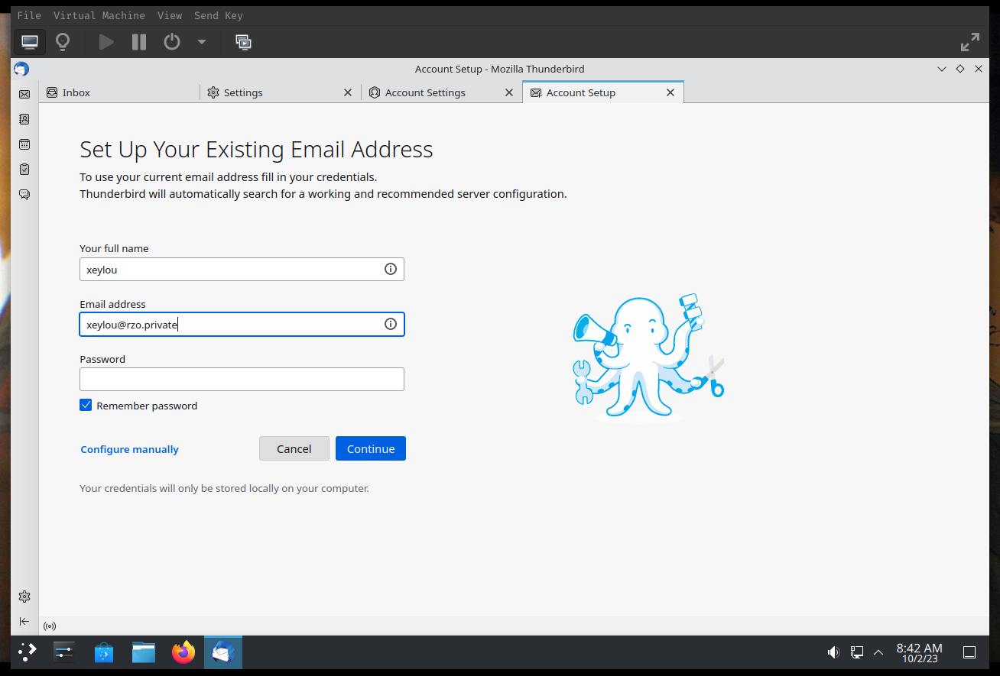
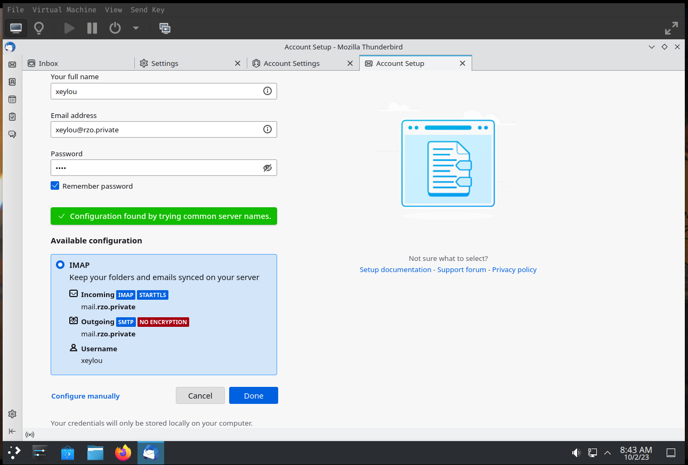
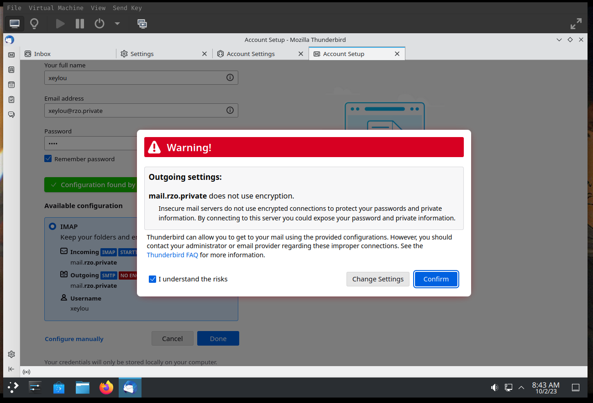
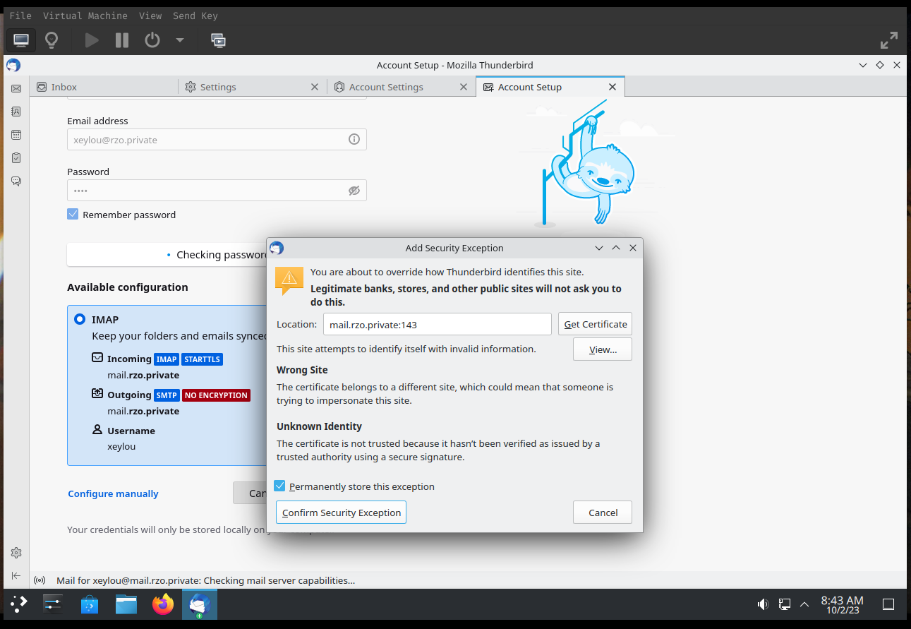
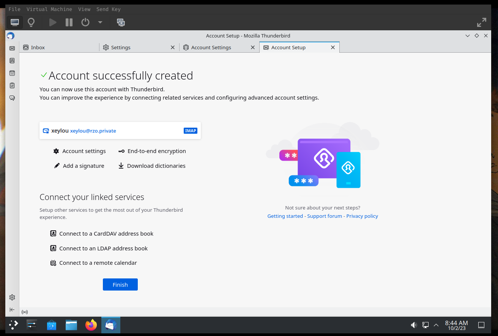

sur une autre VM, mêmes manipulations pour l'utilisateur `testing`

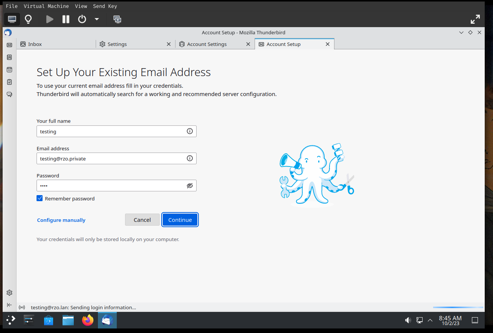
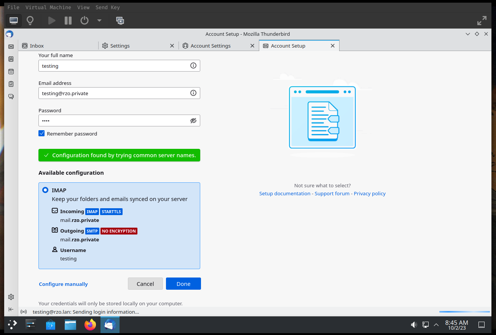
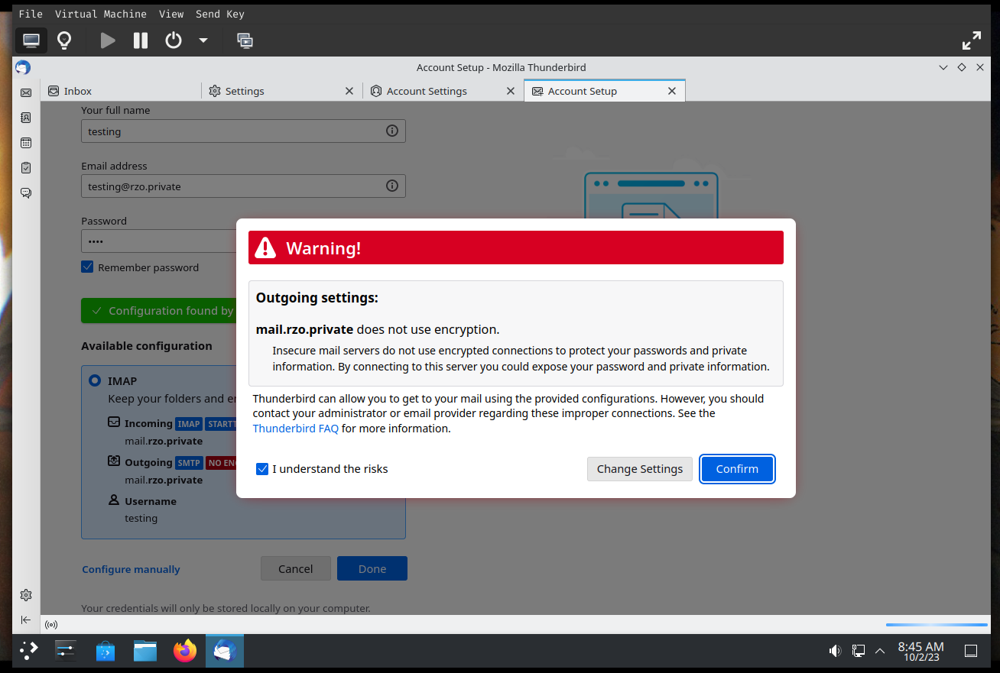
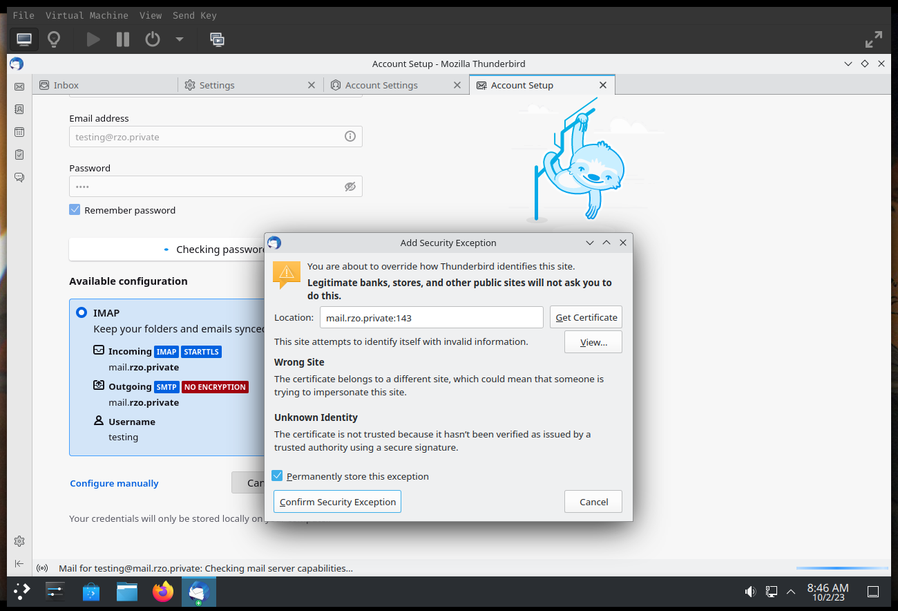
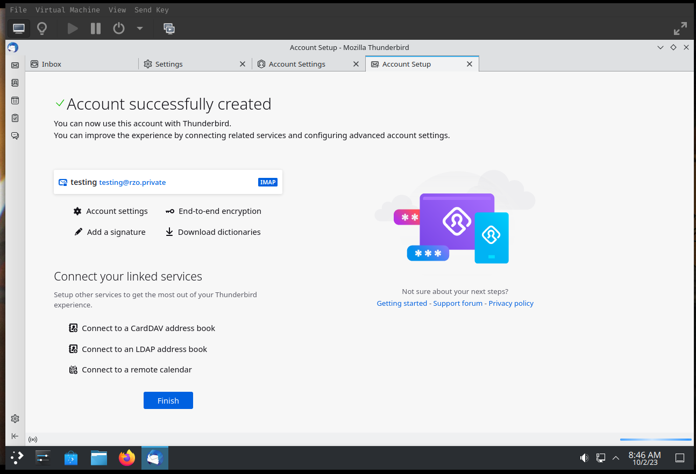

l'envoi et la réception des mails fonctionne

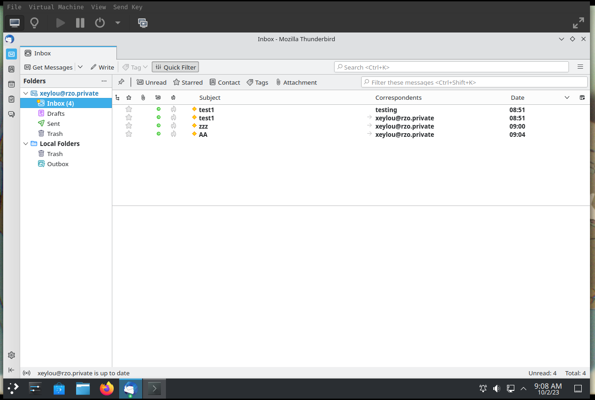

exemple d'envoi d'un mail

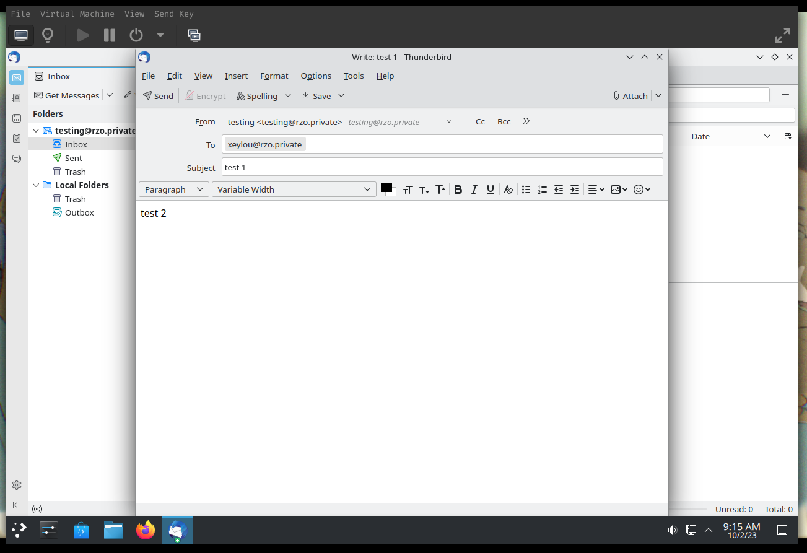
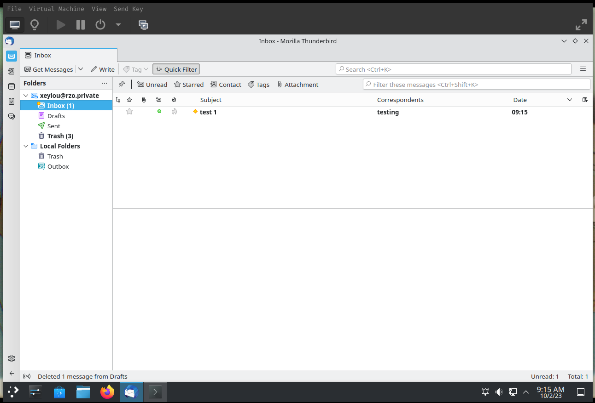
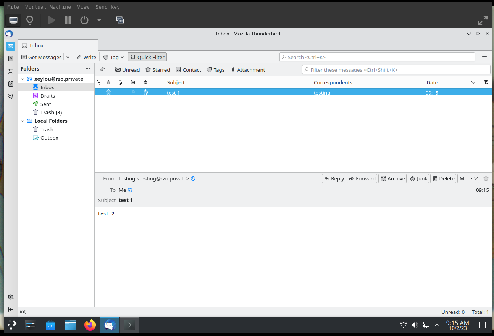

le mail peut être visualisé sur la vm postfix/dovecot

```bash
ls /opt/messagerie/rzo.private/testing/Maildir/.Sent/cur/
```