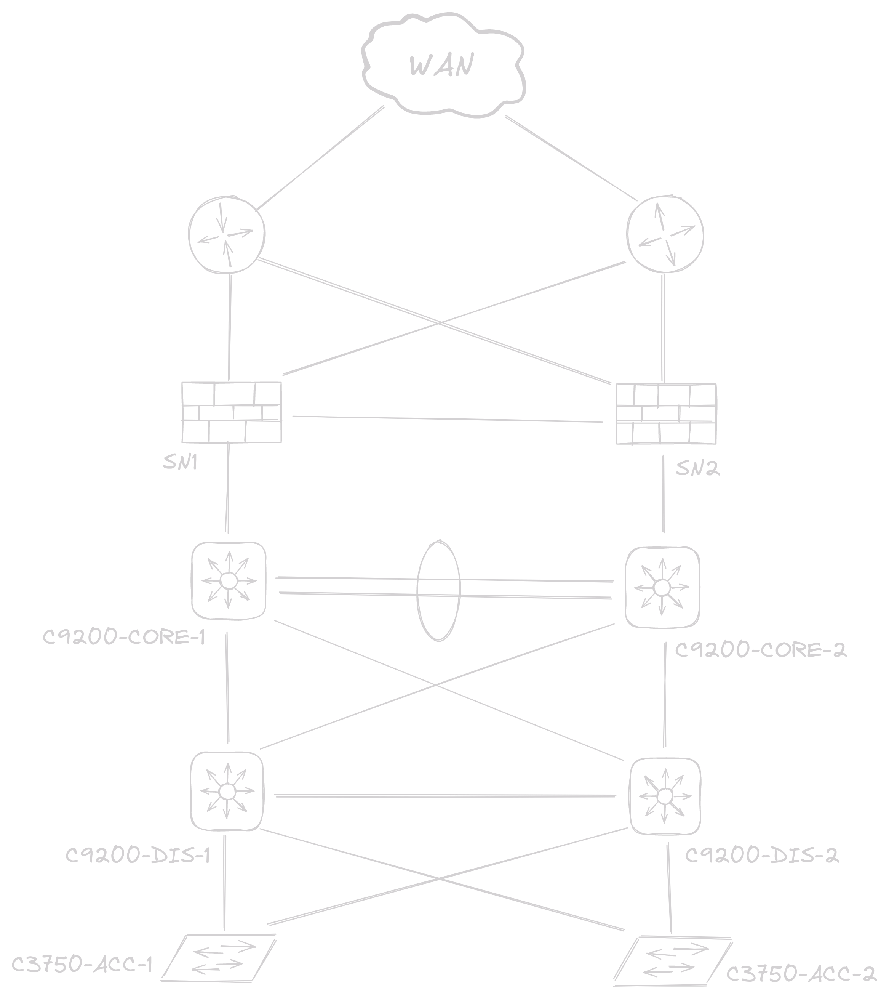
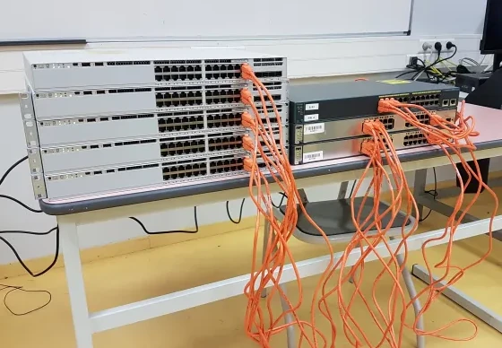

<!-- prologue -->


writing some thoughts,  
mainly about work


<!-- source -->

<!--
https://siddhesh.substack.com/p/projects
-->

<!-- article -->

## introduction

FR : j'expose quelques pensées que j'ai pu avoir sur ma manière de travailler ces derniers temps, si cela peut aider des gens

j'écrirai avec des majuscules en début de phrases pour que ce soit plus agréable à lire, un prologue en anglais sera présent au début des parties pour résumer le raisonnement

EN: i wanted to write some thoughts i had on working nowadays, if it can helps

i'll write w/ capital letters at the beginning of my sentences (i usually don't) to make it more readable, an english prologue will be at the beginning of each thoughts

## hourly income

Hourly income punishes people that are working fast. People that works great charge by the project, not by the time they took it done. Because if you charge by the hour, you get punished for doing well.

You are also incentivized to lie about your time, & you get punished by your salary if you done things quickly or efficiently. Hourly income doesn't make sense for those who works great.

Les personnes compétentes se font avoir si elles sont payées à l'heure. Leur salaire est proportionnel au temps qu'elles mettent à faire leur travail, pas à sa valeur.

Les gens excessivement bons dans leur domaine travailleront mieux && finiront peut-être un projet plus rapidement que d'autres moins compétents. Mais ils finiront par être moins payés parce qu'ils l'auront terminé plus rapidement : ces gens auront mis moins de temps à faire leur travail qu'une personne moins compétente - mais qui sera payée plus pour la même tâche qu'elle aura pris plus de temps à faire.

Quand une personnes est payée à l'heure, elle tend aussi à rallonger son temps de travail pour valoriser son salaire, qui est définit par le temps qu'elle y consacre. Le temps pris est valorisé à la qualité du travail : au plus on met du temps à faire notre travail (moins on en fait), au plus on est rémunéré.

Les personnes compétentes, qui travaillent plus vite que les personnes normales pour la même tâche finissent par être les moins bien payées pour la même activité. Si vous rallongez votre travail, vous êtes payés plus; si vous travaillez mieux, vous êtes payés moins.

Un salaire à l'heure n'est pas intéressant pour une personne qui travaille bien.  
*Hourly income doesn't make sense for those who works great.*

Si tu es payé à l'heure, tu es puni si tu travailles bien.  
*If you charge by the hour, you get punished for doing well.*

> si je sors de mon "one sided view", c'est aussi bien dans une entreprise d'être payé à l'heure comme les autres : pour ne pas créer de rivalités entre qui est payé le plus

> c'est aussi à la responsabilité de l'employeur qui t'a payé à l'heure de savoir s'il aurait du te payer au projet || non, e.g. en freelance (je ne voulais pas que toucher au domaine salarial)

> "tu auras peut-être une version différente de ton discours quand tu auras des enfants", merci, || quand j'aurai une vision différente du travail peut-être, parce que je souhaiterais peut-être mieux valoriser mon temps, || autre...

## never-ending-projects

<!-- linux kernel, little flaws, how it should be improved -->

*There is a better possible version of everything that has ever existed, like, ever.*

I learned it's nealy impossible to finish a personnal project for yourself, because it’s nearly impossible to really know what you want && separate it from what you want to want. It’s impossible to set “deadlines” if they’re not real, that is, imposed by an external authority.

I had a personnal networking project at university. Since they had good equipments laying arround, i politely asked if i could use it for learning purposes, && also to write a post about it later.

But i never published this post, because i couldn't tell where the end of the project would be. It’s impossible to start something and, given enough time and input, not have it grow && evolve into something else entirely. It’s impossible to avoid [scope creep](https://en.wikipedia.org/wiki/Scope_creep).

Here is some images of the draft post. (you can click to zoom on them)

Many of my personnal projects are out of my control because i told myself so many times that *"it lacks of [...], it's fine, i'll do it later"*, or i learn something new because i dug further onto the subject so *"what i done is incredibly wrong, i'll start it over"* : && it never ends

Je retiens que si je fais un projet perso, peu importe avec quoi || dans quel domaine : je dois d'abord me projeter sur ce que je dois avoir plutôt que ce que je veux avoir, vraiment. Sinon, ce que je veux qu'il soit ne cessera de changer parce que j'apprendrai, parce que je changerai d'idée - parce que je le fais pour moi. Je ne fixerai pas non plus de deadline vu que j'ai le temps. Je définis maintenant ce que je fais par rapport à ce que je veux avoir au bout, pas par rapport à ce que j'ai envie d'avoir.

Je dépense une quantité folle de temps parce que je ne peux pas me fixer une limite de temps à ce que je veux : j'ajoute des choses au fur && à mesure que le projet avance, car je le fais pour moi. En recherche, si on aborde un sujet, si on ne s'y met pas de limites, on fini par jamais finir de l'étudier.

Les cours nous donne des délais, une limite de temps à ne pas dépasser pour un module. Quand on fait un projet perso, si on ne se fixe pas de limite, c'est pas possible de prévoir le temps qu'on va y mettre || de le délimiter si on ne sait pas ce qu'on voudra que le projet soit dans 3, 5 jours.

I stopped to told myself that it will be done when it's done, otherwise it will never be